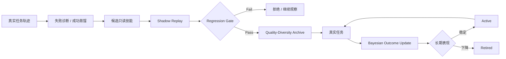

<div align="center">

# EcomEvo

### Autonomous Commerce Runtime

**自主决策 · 自我进化 · 多模态证据 · 可控执行**

把商品治理、商家审核、售后判责、风险核查和内容审核，从一次模型回答升级为能够持续规划、查证、复核、恢复、学习并受控执行的业务任务。

<p>
  
  
  
  
  
</p>

**[产品手册](docs/PRODUCT_MANUAL.md) · [算法说明](docs/ALGORITHM.md) · [技术手册](docs/TECHNICAL_MANUAL.md) · [架构](docs/ARCHITECTURE.md) · [设计系统](docs/DESIGN.md) · [验证报告](docs/VERIFICATION_REPORT.md)**

> **Give the Agent a goal, not a script.**

</div>

---

## 产品预览


<p align="center">
  
</p>

### Demo / 视频

README 以内联图片或短 GIF 作为首屏预览，高清录屏保留 MP4/WebM 原文件并从封面图、Release 或文档入口打开。这样既保留 GitHub 首页的加载速度，也避免把 README 绑定到不稳定的内联视频渲染行为。

---

## 一个任务，不是一轮聊天

真实电商业务很少是“一问一答”。同一个任务可能同时包含订单、物流、商家主体、商品声明、图片、视频、录音、PDF、表格、历史风险与企业内部数据；随着核对推进，还会不断出现新的证据缺口、冲突和分支。

EcomEvo 把这些信息放进一个持续任务：

- 用户给目标，Runtime 决定下一步查什么；
- 文本、图片、视频、音频、文档、表格和日志进入统一证据空间；
- 工具调用可以并行、重排、停止和重规划，而不是固定 DAG；
- specialist 可以按当前任务动态派生，用于反证和专项复核；
- 成功与失败轨迹可以沉淀成技能，并由真实任务结果持续更新可信度；
- 资料不足时明确停止并请求补证；
- 退款、下架、审核、冻结等高影响动作始终在模型权限之外。

```text
Goal
  ↓
Belief / Evidence State
  ↓
EvoLoop
  ├─ Observe
  ├─ Decide
  ├─ EvoGain Route
  ├─ Parallel Tools
  ├─ Delegate Specialists
  ├─ Review
  ├─ Verify
  ├─ Reflect / Replan
  └─ Stop
  ↓
Deterministic Authority
  ↓
Human Approval
  ↓
Business Action
  ↓
Experience → Skill Evolution
```

---

## 核心算法

### EvoLoop：受控自主循环

固定 Planner 只保留业务域、硬约束和确定性证据底线。真正运行路径由当前 missing evidence、预算、工具结果、specialist review 和 verification 状态动态决定。

模型可以提出候选认知动作，但候选本身没有生产执行权。

### EvoGain：证据信息增益路由

模型提出候选工具后，Runtime 再依据证据价值重新排序。

当前基础效用：

\[
R_i=1.70C_i+0.58A_i+0.48S_i+0.36N_i+0.20X_i+0.10P_i
\]

成本归一化：

\[
U_i=\frac{R_i}{0.72+\max(0.15,c_i)^{0.68}}
\]

其中：

- \(C_i\)：当前证据缺口覆盖；
- \(A_i\)：数据源权威性；
- \(S_i\)：已验证技能支持；
- \(N_i\)：信息新颖度；
- \(X_i\)：反证价值；
- \(P_i\)：工具证据通道特异性；
- \(c_i\)：执行成本。

同一轮还会惩罚高度重叠的证据通道，让并行工具尽量覆盖不同信息面。完整公式、停机条件、复杂度和不变量见 **[算法说明](docs/ALGORITHM.md)**。

### Dynamic Task Graph

计划、补证、专项复核、重规划和验证都会进入动态 Task Graph。任务图从真实证据增长，而不是先把工作流画死再强迫任务适配流程。

### Cognitive Topology Mutation

当 verification fingerprint 连续不变化，Runtime 不机械重复同一路径，而是可以增加只读反证审查等 specialist。若仍无新信息增益，则触发 stagnation stop。

---

## 自进化不是自我扩权

EcomEvo 的进化对象是**认知策略和只读技能**，不是生产权限。



每个技能维护 Beta posterior。Shadow replay 只影响初始先验；真正的成功和失败继续更新 \(\alpha\) / \(\beta\)。相同 pathology niche 只保留更强代表，避免 skill library 被大量同质 prompt 变体污染。

> **策略可以进化，权限不能自我扩张。**

---

## 多模态证据管线

支持：**文字 · 图片 · 视频 · 音频 · PDF · Word · Excel · CSV / JSON · 日志**。

处理原则：

1. 上传先做类型、结构、容量和内容指纹检查；
2. 文本型资料本地解析并建立有界索引；
3. 图片、视频关键帧、音频和扫描文档进入事实提取通道；
4. 多模态模型只提取可观察事实，不直接决定业务处置；
5. 已核对事实进入统一证据链，再由 Runtime 进行业务验证；
6. 无法读取、低置信度或证据不完整时 fail closed。

---

## 认知自治，权限确定

Agent 可以：

- 选择下一步只读工具；
- 并行查证；
- 动态委派 specialist；
- 召回已验证技能；
- 改变探索策略；
- 重规划；
- 停止低价值探索。

Agent 不可以：

- 把历史回答、memory、skill 或模型判断当独立业务证据；
- 降低 Verifier 的硬证据门槛；
- 给自己增加生产权限；
- 直接执行退款、下架、审核、冻结等高影响动作；
- 在下游结果不确定时自动盲重试。

---

## Agent-native 工作台

EcomEvo 的操作台不是“聊天框 + 一排卡片”。

- **左侧**：业务入口与持续任务；
- **中间**：目标、多模态资料、运行状态和业务结论；
- **右侧**：轨迹、证据、执行控制和任务资料。

视觉系统采用 **暖瓷白 + 石墨 + 氧化橙 + 玉石绿**。中文正文以 16px 级为主，Display 使用 600 weight，支持文本原则上不低于 12px。Motion 只解释进入、状态变化、运行中和空间连续性，并完整支持 `prefers-reduced-motion`。

详细规范见 **[设计系统](docs/DESIGN.md)**。

---

## 模型与部署策略

认知引擎是可替换能力，不是业务权限中心。

EcomEvo 支持已接入的云端服务、企业兼容接口，以及 OpenAI-Compatible 的开源权重 / 自托管推理服务：

```bash
OPEN_MODEL_BASE_URL=http://your-runtime/compatible-endpoint
OPEN_MODEL_API_KEY=your-key
OPEN_MODEL_MODEL=your-current-model
OPEN_MODEL_MULTIMODAL=0
```

模型名由部署方配置。更换权重不需要重写 EvoGain、Verifier、Sandbox、技能库和审批边界。

---

## 快速启动

```bash
python -m venv .venv
source .venv/bin/activate
pip install -r requirements.txt
cp .env.example .env
uvicorn ecomevo.api.app:app --host 0.0.0.0 --port 8000
```

打开 `http://localhost:8000`。

Docker：

```bash
docker build -t ecomevo .
docker run --rm -p 8000:8000 --env-file .env -v ecomevo-data:/app/outputs ecomevo
```

---

## 工程验证

当前仓库保留常规自动化测试；升级期间的专项压力脚本没有提交到仓库。

曾执行的本地工程压力记录包括：

| 场景 | 结果 |
| --- | ---: |
| Shared SQLite Runtime | 240 concurrent runs |
| Throughput | 37.2 runs/s |
| p95 | 5.22 s |
| Event-chain failures | 0 |
| Incomplete-case side-effect leaks | 0 |
| Adversarial controller | 80 concurrent runs |
| Unsafe proposals rejected | 80 / 80 |
| Side-effect leaks | 0 |

这些是本地工程压力数据，不是第三方 benchmark 排名。SQLite single-writer 仍是当前单节点扩展上限之一。

完整验证边界见 **[验证报告](docs/VERIFICATION_REPORT.md)**。

---

## 文档

| 文档 | 面向对象 | 内容 |
| --- | --- | --- |
| [产品手册](docs/PRODUCT_MANUAL.md) | 运营 / 审核 / 客服 / 风控 | 如何创建任务、补证、纠错、理解状态和确认动作 |
| [算法说明](docs/ALGORITHM.md) | Agent / ML / Research | EvoLoop、EvoGain、Bayesian skills、QD archive、公式与复杂度 |
| [技术手册](docs/TECHNICAL_MANUAL.md) | 平台 / 后端 / 安全 / 二开 | 模块、API、数据流、MCP、恢复、权限和部署 |
| [架构](docs/ARCHITECTURE.md) | 工程团队 | Runtime 总体架构与边界 |
| [设计系统](docs/DESIGN.md) | 产品 / UI / 前端 | Typography、layout、motion、Agent UX 与 anti-slop |
| [验证报告](docs/VERIFICATION_REPORT.md) | 研发 / QA | 已执行验证、压力数据与限制 |

---

<div align="center">

### EcomEvo

**目标交给 Agent，权限留给业务。**

</div>
