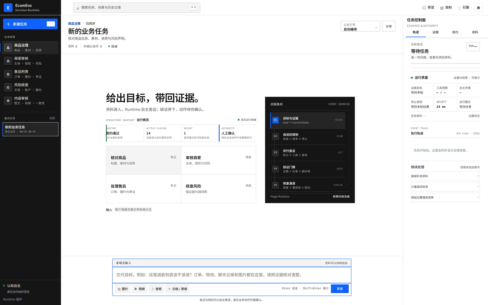
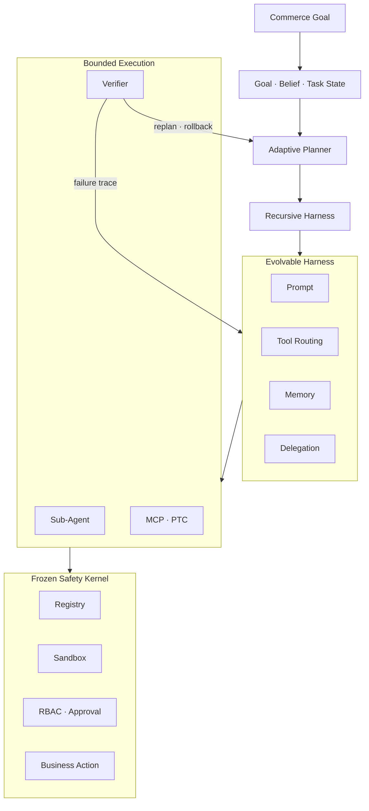
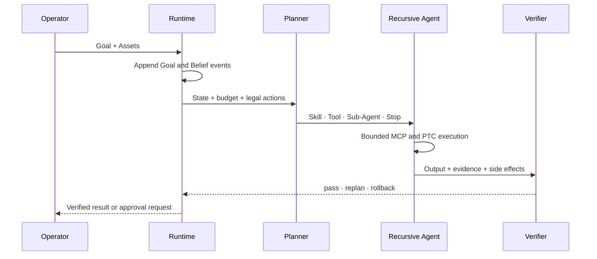
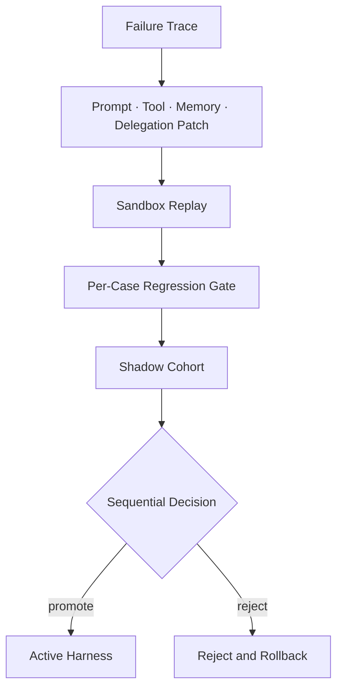
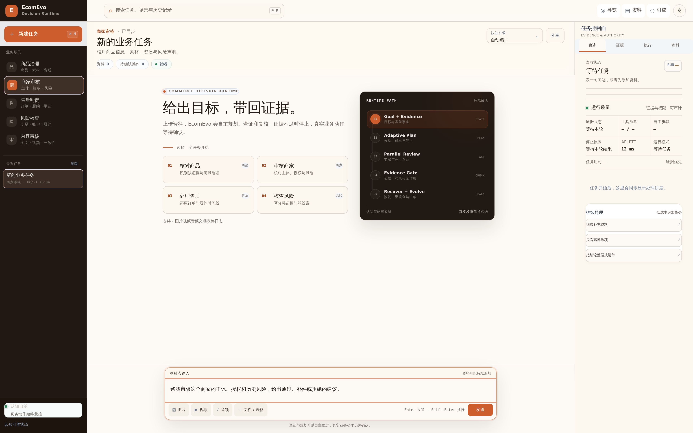
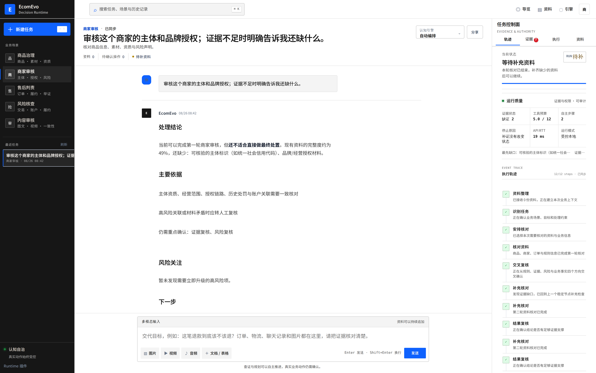
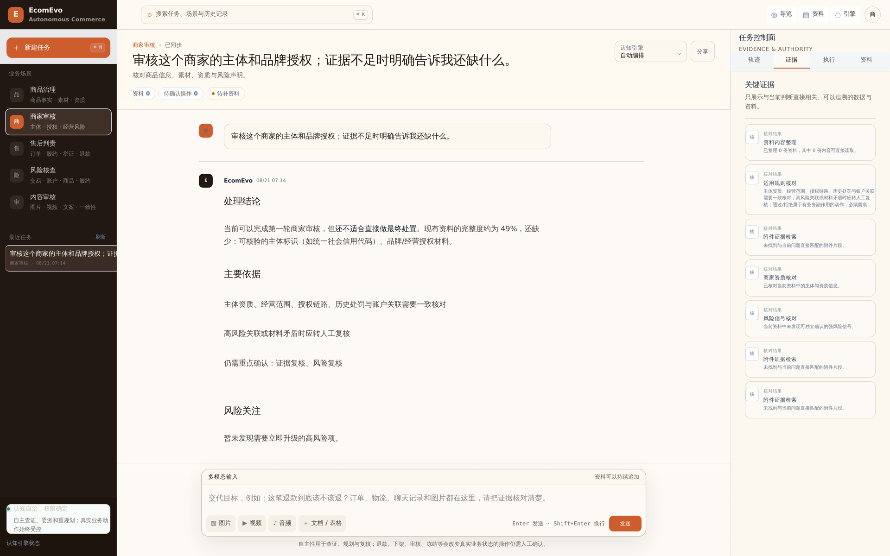
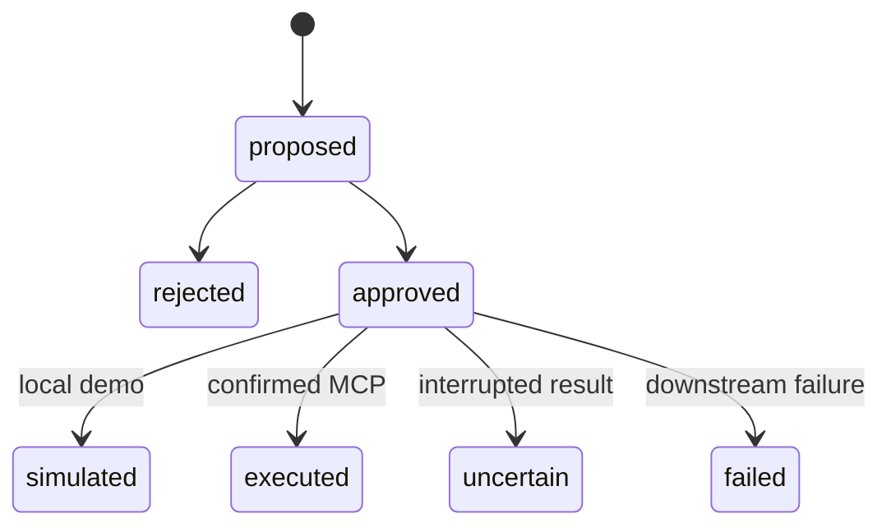

<div align=center>

# EcomEvo

[](https://github.com/jiaweine/EcomEvo-Harness/actions/workflows/ci.yml)
[](https://github.com/jiaweine/EcomEvo-Harness/actions/workflows/codeql.yml)

### Self-Evolving Commerce Decision Agent Harness Runtime

**让 Agent 在证据、权限与回滚边界内自主完成复杂电商决策，并从失败中安全演进。**

`PLUGIN RUNTIME` · `EVENT SOURCING` · `ADAPTIVE PLANNER` · `RECURSIVE AGENT` · `MCP / PTC` · `VERIFIER` · `HARNESS EVOLUTION`

</div>



<sub>仓库真实产品截图，由 FastAPI 与 Chromium Browser E2E 自动采集。不是概念稿、设计稿或第三方产品界面。</sub>

---

# Product Thesis · Commerce Decisions Need a Runtime

**目标解析 → Belief State → 自主规划 → 递归子 Agent → 工具执行 → 验证回滚 → Harness 演进**

| CONTROL | TRUST | LIFECYCLE | EVOLUTION |
|---|---|---|---|
| **权限可控**<br>退款、下架、审核、风险升级进入人工确认边界 | **结论可核验**<br>判断回到资料、工具结果与可验证状态 | **任务可持续**<br>目标、证据、动作和事件属于同一个耐久任务 | **失败可演进**<br>失败轨迹生成候选 patch，经回放与回归门禁后晋级 |

EcomEvo 不是把模型接入聊天框，而是把模型放入一个模型无关的 Agent Harness Runtime。Model、Tool、Skill、Memory、Sandbox 与 Verifier 都可以替换；任务事实、权限约束、事件历史和恢复路径由 Runtime 持有。

模型负责推理，Harness 负责让推理可执行、可验证、可恢复、可演进。

---

# Agent Architecture · Frozen Kernel × Evolvable Harness



## 01 · What Can Evolve

| Coordinate | Runtime role | Evolution boundary |
|---|---|---|
| Prompt | 任务解释、计划提示与角色约束 | 只修改认知提示，不改变权限 |
| Tool | Skill 与只读工具的选择策略 | 只能从 Registry 与 Sandbox 允许集合中选择 |
| Memory | 失败模式、业务经验与检索上下文 | 不覆盖事件事实与原始证据 |
| Delegation | 子任务拆分、深度与 specialist 路由 | 受递归深度、预算、并发和 deadline 限制 |

## 02 · What Stays Frozen

| Frozen component | Invariant |
|---|---|
| Registry | 插件类型、实例和允许能力明确注册 |
| Sandbox | 工具副作用与执行边界不可被候选 patch 绕过 |
| Verifier | 证据、约束、输出与副作用独立校验 |
| RBAC / Approval | 高影响动作始终需要具备权限的人确认 |
| BusinessAction | proposed、approved、simulated、executed、uncertain、failed 保持语义分离 |
| Event Store | append-only hash chain、checkpoint 与 fork 构成任务事实源 |

## 03 · Event-Sourced Execution



PTC 只并行组合 Sandbox 允许的读工具。共享 semaphore 限制 Runtime fan-out，单次工具 deadline 从排队前开始并覆盖背压等待与实际执行。会改变商品、商家、订单或风险状态的动作不进入自主 PTC，而是形成 `BusinessAction` 等待 approver 确认。

## 04 · Failure-Driven Evolution



Harness Evolution 采用 block-coordinate 更新，一次只改变一个认知坐标。候选版本先对历史失败轨迹做无副作用回放，再逐案例比较基线，通过后才进入 shadow cohort。在线证据不足时继续观察，后验风险越高，shadow 流量越低；达到晋级或拒绝边界后才提交决策。

---

# Real Product · Commerce Decision Workbench

下面全部是当前仓库运行产生的真实浏览器截图。产品把目标、资料、证据、计划、恢复状态与待确认动作集中在同一个持续任务空间。

| **01 · Five Commerce Scenarios** | **02 · Runtime and Recovery** |
|---|---|
| 商品治理、商家审核、售后判责、风险核查、内容审核从统一工作台进入。<br><br> | 自主步骤、证据缺口、工具预算、停止原因和补证状态实时呈现。<br><br> |

| **03 · Evidence Surface** | **04 · Decision Workspace** |
|---|---|
| 规则、资料、商家核对与风险信号形成独立证据卡，不把模型措辞当作证据。<br><br> | 对话、资料、判断、动作和审计轨迹保留在同一个耐久任务中。<br><br> |

截图证据来自 [EcomEvo CI #267 Browser E2E](https://github.com/jiaweine/EcomEvo-Harness/actions/runs/32457711643)。当前 Runtime 改动由 [EcomEvo CI #268](https://github.com/jiaweine/EcomEvo-Harness/actions/runs/32500923467) 与 [CodeQL #10](https://github.com/jiaweine/EcomEvo-Harness/actions/runs/32500923273) 验证。

---

# Method · Adaptive Planning and Safe Evolution

## 01 · Legal Action Space Before Learning

Planner 先由 Registry、Sandbox、RBAC、预算与任务约束构造合法动作集合，再在集合内学习。不可执行动作不会因模型置信度或历史收益而被选中。

$$
\mathcal{A}_{legal}(s)=\mathcal{A}_{registered}\cap\mathcal{A}_{sandbox}\cap\mathcal{A}_{authority}\cap\mathcal{A}_{budget}
$$

## 02 · Bayesian Utility Routing

EvoGain-APR 用 12 维上下文描述任务状态，对 Skill、Tool、Sub-Agent 与 Stop 维护 Bayesian posterior，并以确定性 UCB 在预期收益、风险和成本之间选择。

$$
a_t=\arg\max_{a\in\mathcal{A}_{legal}}\left(\mu_a(x_t)+\beta\sigma_a(x_t)-\lambda C(a)\right)
$$

当所有候选的净价值不足时，Planner 可以 abstain，而不是为了制造轨迹继续调用工具。

## 03 · Verifier Difference Credit

Verifier 以证据完备性、约束满足度和副作用安全性形成调和势能，并用 leave-one-out 反事实衡量某次工具调用的真实增量。

$$
\Delta_i=\Phi(E)-\Phi(E\setminus\{e_i\})
$$

无增益或重复证据不会因为出现在成功轨迹中而自动获得正向 credit。

## 04 · Hash-Bound Recovery

Checkpoint 同时绑定事件位置、事件 hash 与状态 hash。恢复前重新计算并核验两条链，任何漂移都会拒绝 restore。

$$
c_k=(k, h^{event}_k, h^{state}_k)
$$

Verifier 触发 rollback 后，Runtime 只从完整性验证通过的 checkpoint 重建 Belief State，再基于失败证据 replan。

## 05 · Replay Before Shadow

候选 Harness 必须先通过逐案例回放门禁，不能用总体均值掩盖单个关键用例退化。

$$
\forall i,\; S_i(candidate)\ge S_i(baseline)-\epsilon_i
$$

通过回放后才进入 posterior shadow allocation；promotion 与 rejection 都需要跨越顺序决策边界。

---

# Evidence · What the Repository Proves

| Gate | Verified scope |
|---|---|
| Python regression | 247 项测试，覆盖 Runtime、Event Store、Planner、Verifier、MCP、RBAC 与演进 |
| Gold Set | 9 个业务案例执行 fresh run 与 persisted replay |
| Product smoke | 临时 durable root 下验证任务、资料、动作与 API 主链 |
| Pressure gate | 1 / 8 / 32 / 64 / 120 / 240 Runtime，并覆盖 PTC deadline 与 adaptive-policy contention |
| Browser E2E | 真实 Uvicorn + Chromium，桌面、移动、WebSocket、任务恢复和截图尺寸 |
| Packaging | 构建 wheel，在干净环境安装并启动 health、首页与静态资源 |
| Container | 非 root、只读根文件系统、独立数据挂载与 health probe |
| Security | pip-audit、Bandit 与 CodeQL Python / JavaScript |

当前实现与恢复门禁的完整变更记录见 [PR #15](https://github.com/jiaweine/EcomEvo-Harness/pull/15)。

## Why This Is Not Prompt Self-Optimization

| Superficial approach | EcomEvo Harness Evolution |
|---|---|
| 直接改写系统 Prompt | Prompt、Tool、Memory、Delegation 分坐标更新 |
| 成功轨迹统一奖励 | Verifier difference credit 识别真实增量 |
| 离线平均分通过即上线 | 逐案例 replay gate 后再进入 shadow |
| 在线全量替换 | posterior allocation 与 sequential promotion |
| 失败后继续重试 | checkpoint integrity、rollback 与 evidence-driven replan |
| 模型决定权限 | Frozen Sandbox、RBAC、Approval 与 BusinessAction |

<details>
<summary><b>Research Provenance</b></summary>

EcomEvo 的核心方法来自仓库内可运行实现，而不是只在 README 中声明。算法说明集中在 [ALGORITHM](docs/ALGORITHM.md)，自主循环与停止条件见 [AUTONOMY](docs/AUTONOMY.md)，Harness 坐标、回放、shadow 与晋级规则见 [HARNESS EVOLUTION](docs/HARNESS_EVOLUTION.md)。

当前设计吸收 contextual bandit、Bayesian linear posterior、counterfactual credit、event sourcing 与 sequential decision 的工程思想。仓库文档对外部研究只作为方法来源，不将预印本或内部验证描述为已接受论文结论。

</details>

<details>
<summary><b>Engineering Map</b></summary>

| Concern | Primary implementation |
|---|---|
| Plugin Runtime | `ecomevo/runtime/plugins.py` |
| Event Store and checkpoint | `ecomevo/runtime/event_store.py` |
| Adaptive Planner | `ecomevo/runtime/planner.py` |
| Recursive Harness | `ecomevo/runtime/recursive.py` |
| MCP and PTC | `ecomevo/runtime/mcp.py` · `ecomevo/runtime/tools.py` |
| Verifier and recovery | `ecomevo/runtime/verifier.py` · `ecomevo/runtime/engine.py` |
| Harness Evolution | `ecomevo/runtime/harness_evolution.py` |
| Durable product API | `ecomevo/api/application.py` |
| Regression and eval gates | `tests/` · `scripts/eval_gate.py` · `scripts/pressure_gate.py` |

</details>

---

# Product Surface · Context, Tasks, Boundaries

## Multimodal Context

| Input | Runtime path |
|---|---|
| Text / CSV / JSON / Log | 本地解析与文本 Provider |
| Image | 支持视觉输入的 Provider |
| Audio | 音频 Provider 或业务侧预处理 |
| Video | 本地关键帧提取与视觉 Provider |
| PDF / Office / Table | 文档解析与必要的外部 Provider |

## Suitable Work

| Scenario | Decision focus |
|---|---|
| 商品治理 | 标题、主图、声明、品牌与资质一致性 |
| 商家审核 | 主体、授权链、经营范围与历史风险 |
| 售后判责 | 订单、物流、聊天、媒体证据与规则时间线 |
| 风险核查 | 强证据、弱线索、反证与人工复核优先级 |
| 内容审核 | 图文一致性、误导风险、违规点与证据缺口 |

## Product Boundary



`simulated` 只代表本地演示链路完成。`executed` 只用于已经确认的真实下游结果。传输中断且无法确认副作用时进入 `uncertain`，不会伪装成成功或普通失败。

| Capability | Status | Boundary |
|---|---|---|
| Plugin Runtime | READY | Model / Planner / Tool / Skill / Memory / Agent / Sandbox / Verifier 可注入 |
| Event-Sourced Runtime | READY | Goal / Belief / Task 事件、hash chain、checkpoint 与 fork |
| Adaptive Planner | READY | Bayesian routing、成本收益、abstention 与反事实 credit |
| Recursive Agent + PTC | READY | 有界递归与有界并行只读工具组合 |
| Verifier recovery | READY | 证据、约束、副作用验证与 hash-bound rollback |
| Harness Evolution | GATED | Replay + Regression + shadow posterior；安全内核不可演进 |
| High-impact action | GUARDED | 必须经过明确人工确认 |
| Real commerce execution | CONFIG | 需要可用 MCP、企业身份与下游业务系统 |

---

# Quick Start

## macOS / Linux

```bash
git clone https://github.com/jiaweine/EcomEvo-Harness.git
cd EcomEvo-Harness

python -m venv .venv
source .venv/bin/activate
python -m pip install -e .

cp .env.example .env
uvicorn ecomevo.api.app:app --host 0.0.0.0 --port 8000
```

## Windows PowerShell

```powershell
git clone https://github.com/jiaweine/EcomEvo-Harness.git
cd EcomEvo-Harness

python -m venv .venv
.venv\Scripts\Activate.ps1
python -m pip install -e .

Copy-Item .env.example .env
uvicorn ecomevo.api.app:app --host 0.0.0.0 --port 8000
```

## Docker

```bash
docker build -t ecomevo .
docker run --rm -p 8000:8000 --env-file .env -v ecomevo-data:/app/outputs ecomevo
```

打开 `http://localhost:8000`。没有配置外部模型时，仍可使用本地演示能力体验文本、结构化资料与任务流程。

---

# Runtime API

| Surface | Endpoint |
|---|---|
| Product / health | `/api/product` · `/healthz` · `/api/health` |
| Provider / runtime | `/api/providers` · `/api/runtime` · `/api/evolution` |
| Conversations | `/api/conversations` · `/api/conversations/{id}` |
| Assets | `/api/conversations/{id}/assets` · preview · scope · delete |
| Messages / actions | `/api/conversations/{id}/messages` · `/api/conversations/{id}/actions` |
| Runtime events | `/api/runtime/sessions/{session_id}/events` |
| Live updates | WebSocket task event channel |

---

# Repository

```text
ecomevo/
├── api/                 Product API, durable jobs, identity and RBAC
├── runtime/             Events, planner, agents, tools, verifier and evolution
└── web/                 Commerce decision workbench

docs/                    Architecture, algorithms, evolution and deployment
scripts/                 Smoke, evaluation, pressure and browser gates
tests/                   Runtime, product, security and concurrency regression
```

| Document | Scope |
|---|---|
| [ARCHITECTURE](docs/ARCHITECTURE.md) | 系统组件、数据流与边界 |
| [AUTONOMY](docs/AUTONOMY.md) | 自主循环、停止、恢复与权限 |
| [ALGORITHM](docs/ALGORITHM.md) | EvoGain-APR、Bayesian routing 与 credit |
| [HARNESS EVOLUTION](docs/HARNESS_EVOLUTION.md) | Replay、shadow、promotion 与 rollback |
| [TECHNICAL MANUAL](docs/TECHNICAL_MANUAL.md) | API、durable job、MCP、身份与部署 |
| [VERIFICATION REPORT](docs/VERIFICATION_REPORT.md) | 工程验证记录 |
| [CONTRIBUTING](CONTRIBUTING.md) | 开发门禁与架构不变量 |
| [SECURITY](SECURITY.md) | 安全支持范围与漏洞报告 |

---

<div align=center>

**EcomEvo**

Evidence First · Recovery by Design · Evolution Behind Gates

**让复杂商业决策自主推进，让每一次真实动作都可验证、可恢复、可追责。**

</div>
