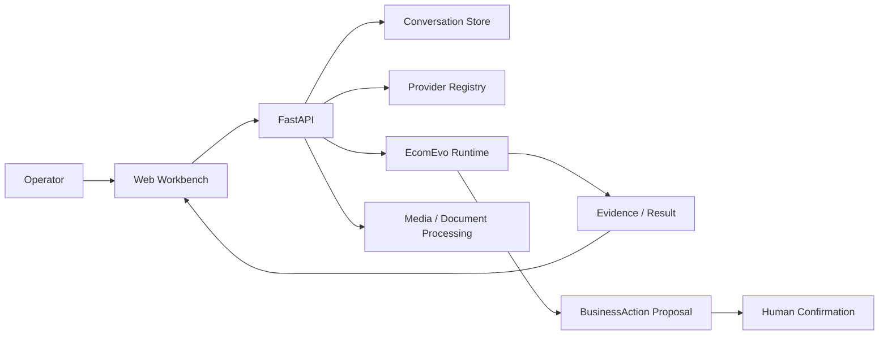

<p align="center"><sub>ECOMMERCE DECISION WORKBENCH</sub></p>

<h1 align="center">EcomEvo</h1>

<p align="center"><strong>把复杂电商业务，从“问 AI”推进到“持续组织证据、形成判断、确认后执行”。</strong></p>

<p align="center"><b>目标进入任务 · 证据持续累积 · 结论有依据 · 高影响动作始终受控</b></p>

<p align="center">
  
  
  
  
</p>

<p align="center">
  <b>
    <a href="#60-秒看懂产品">产品导览</a> ·
    <a href="#quick-start">快速开始</a> ·
    <a href="docs/ARCHITECTURE.md">架构</a> ·
    <a href="docs/DESIGN.md">设计</a> ·
    <a href="docs/VERIFICATION_REPORT.md">验证</a>
  </b>
</p>

<br />

<p align="center">
  
</p>

<p align="center">
  <sub><b>EcomEvo 商业决策工作台</b> · 目标、对话、多模态资料、关键依据和待确认业务动作都属于同一个持续任务。</sub>
</p>

---

## EcomEvo 是什么

很多电商问题并不缺“一个答案”，缺的是一个**能把判断过程做完整的工作空间**。

一次商品治理，可能同时要核对标题、主图、详情、功效声明、资质和品牌授权；一次售后判责，可能要把订单、物流、聊天、图片和平台规则拼回同一条事实时间线；一次商家审核，则要同时看主体、授权链、经营范围和历史风险。

普通聊天式 AI 往往把这些步骤压缩成一次回答。EcomEvo 的产品目标不同：

> **把一个真实业务目标变成持续任务，把资料变成证据，把证据变成可复核判断，再把高影响动作留给明确确认。**

这意味着用户不需要反复复制背景，也不需要在多个工具之间手动维护“刚才已经确认了什么”。

<table>
  <tr>
    <td width="25%" valign="top"><b>Continuous Task</b><br/><br/>围绕一个 conversation 持续补资料、追问、修改要求，业务上下文不会因为一次回答结束而消失。</td>
    <td width="25%" valign="top"><b>Multimodal Evidence</b><br/><br/>图片、视频、音频、PDF、Office、表格、JSON、日志和结构化业务数据进入同一个任务空间。</td>
    <td width="25%" valign="top"><b>Evidence Oriented</b><br/><br/>不只输出结论，还把关键依据、资料缺口、冲突和仍需确认的部分显式呈现。</td>
    <td width="25%" valign="top"><b>Controlled Action</b><br/><br/>退款、下架、审核、风险升级等会改变业务状态的动作，与认知判断分开并保留确认边界。</td>
  </tr>
</table>

<br />

## 60 秒看懂产品

### 1. 先说清“要做什么判断”

EcomEvo 不是从一个空白聊天框开始，而是先把任务放进明确业务场景：

| 场景 | 典型问题 |
| --- | --- |
| **商品治理** | 标题、主图、详情、声明、品牌和资质是否一致，哪些商品需要补件、修改或下架 |
| **商家审核** | 主体、资质、授权链、经营范围和历史风险能否形成可信闭环 |
| **售后判责** | 订单、履约、聊天和举证如何还原事实，退款或责任应如何建议 |
| **风险核查** | 哪些是强风险证据，哪些只是弱线索，是否需要升级人工复核 |
| **内容审核** | 图片、视频、文案和商品事实是否一致，哪里可能违规、误导或缺证据 |

<p align="center">
  
</p>

### 2. 资料持续进入同一个任务

用户可以先提问题，也可以先上传材料。后续新增的截图、视频、录音、合同、表格、日志或结构化数据，会继续挂在同一个任务下。

<p align="center">
  
</p>

这不是简单的“附件列表”。产品上更重要的是让用户能够区分：

- **现有事实**：已经能从材料中直接确认的内容；
- **关键依据**：当前结论真正依赖的证据；
- **证据缺口**：还缺什么材料，为什么当前不能下定论；
- **冲突信息**：不同资料之间哪里互相矛盾；
- **业务动作**：哪些操作会影响真实商品、商家、订单或风险状态。

### 3. 先看依据，再决定是否行动

右侧任务详情把“进度 / 依据 / 待确认 / 资料”拆开。用户不需要看到隐藏思维链，但应该知道：

**现在处理到哪一步、关键依据是什么、还缺什么、系统建议做什么，以及最后一步由谁确认。**

<p align="center">
  
</p>

---

## 当前主分支已经能做什么

`main` 当前不是一个只有概念图的空壳。它已经包含一套可直接运行的产品闭环：

- 五类业务入口：商品治理、商家审核、售后判责、风险核查、内容审核；
- 持续 conversation：历史任务、任务切换、分享链接、消息记录；
- 多资料输入：图片、视频、音频、PDF、Word、Excel、CSV、JSON、日志等；
- 资料预览与元数据提取；
- Provider 选择与本地演示执行器；
- 任务进度、关键依据和后续建议；
- 高影响 `BusinessAction` 提案与人工确认；
- WebSocket 任务状态同步；
- 桌面端与移动端响应式工作台；
- 首次产品导览，可从顶部“导览”随时重新打开。

### 能力边界

为了避免 README 把“规划中的能力”写成“已经上线”，这里明确区分当前可用能力和开发中的能力：

| 能力 | 当前状态 |
| --- | --- |
| 持续业务任务 | ✅ 主分支可用 |
| 五类业务场景 | ✅ 主分支可用 |
| 文本 / 结构化资料本地演示 | ✅ 主分支可用 |
| 图片 / 音视频 / 扫描件理解 | ✅ 需要配置支持对应能力的 Provider |
| 证据面板 / 进度 / 待确认动作 | ✅ 主分支可用 |
| 自动执行高影响业务动作 | ❌ 不允许静默执行，必须经过确认边界 |
| Adaptive Autonomous Runtime | 🧪 在 Draft PR #3 中持续验证，未视为 `main` 已上线能力 |

> **认知可以自动，权限不能自动。**
>
> EcomEvo 可以帮助组织证据和形成判断，但不会因为“模型更聪明”就自动获得更多业务权限。

---

## 产品设计上的关键差异

### 不是“聊天记录”，而是“任务状态”

EcomEvo 中一个任务同时包含目标、消息、资料、证据、处理进度、结论和待确认动作。对话只是交互方式，不是系统唯一的数据结构。

### 不是“模型说了算”，而是“证据可回看”

产品默认把模型输出视为候选判断，而不是天然事实。真正重要的结论应该能回到：

- 用户上传的业务资料；
- 结构化数据；
- 已注册的业务工具结果；
- 明确的平台规则或企业规则；
- 可验证的状态变化。

### 不是“自动化越多越好”，而是“权限边界越清楚越好”

EcomEvo 将认知过程与业务执行拆开。系统可以建议退款、下架、拒绝、升级风险，但涉及真实业务副作用时，应保留确认、权限和执行结果。

---

## First-run Product Tour

本次产品补全加入了真正的首次导览，而不是把用户直接丢进空白工作台。

首次打开时，产品会说明：

1. EcomEvo 解决的不是“回答问题”，而是“完成一次业务判断”；
2. 如何按 **目标 → 证据 → 判断 → 确认** 使用工作台；
3. 五类业务场景分别处理什么；
4. 本地演示和外部多模态 Provider 的能力边界；
5. 为什么高影响动作不会自动执行。

顶部 **“导览”** 按钮可以随时重新打开产品介绍；共享 conversation 链接默认不会被首次导览打断。

---

## Quick Start

### 1. 本地运行

```bash
python -m venv .venv
source .venv/bin/activate
python -m pip install -e .
cp .env.example .env
uvicorn ecomevo.api.app:app --host 0.0.0.0 --port 8000
```

Windows PowerShell：

```powershell
python -m venv .venv
.venv\Scripts\Activate.ps1
python -m pip install -e .
Copy-Item .env.example .env
uvicorn ecomevo.api.app:app --host 0.0.0.0 --port 8000
```

打开：

```text
http://localhost:8000
```

首次启动即使没有配置外部模型，也可以使用本地演示能力体验文本和结构化资料流程。

### 2. Docker

```bash
docker build -t ecomevo .
docker run --rm \
  -p 8000:8000 \
  --env-file .env \
  -v ecomevo-data:/app/outputs \
  ecomevo
```

### 3. 配置外部 Provider

复制 `.env.example` 后按需要配置对应模型或 OpenAI-compatible 服务。没有配置的 Provider 会在界面中明确标记为“未配置”。

多模态能力取决于实际 Provider：

- 图片理解需要 Provider 支持视觉输入；
- 音频需要 Provider 或业务侧预处理支持；
- 扫描 PDF 需要 OCR / 视觉能力；
- 文本、CSV、JSON、日志等可直接走本地或文本 Provider 流程。

---

## 典型使用方式

### 商品治理

上传商品标题、主图、详情页、资质和品牌授权后，可以直接要求：

```text
帮我核对这批商品的标题、主图和详情，
找出需要下架或补资质的高风险项，并说明依据。
```

### 商家审核

```text
结合营业执照、品牌授权、经营范围和历史风险，
给出通过、补件或拒绝建议，并列出仍然缺失的证据。
```

### 售后判责

```text
结合订单、物流、聊天记录和用户举证，
还原时间线并给出责任判断。不要自动退款。
```

### 风险核查

```text
把这些异常交易里的强证据、弱线索和反证分开，
判断是否值得升级人工复核。
```

### 内容审核

```text
核对这组商品图片、视频和文案与商品事实是否一致，
标出误导、违规或需要补证据的内容。
```

---

## Architecture

当前主分支可以概括为：



更详细的组件边界见 **[docs/ARCHITECTURE.md](docs/ARCHITECTURE.md)**。

---

## Adaptive Runtime 开发线

仓库中另有 **[Draft PR #3](https://github.com/jiaweine/EcomEvo-Harness/pull/3)**，用于验证更进一步的 Adaptive Autonomous Runtime，包括：

- 受约束的自主 evidence acquisition；
- adaptive routing；
- verifier-grounded credit；
- durable execution；
- RBAC / tenant boundaries；
- MCP uncertainty；
- 更完整的 release gates。

这条开发线有价值，但它与当前稳定产品介绍分开表达。README 不再把 Draft PR 的研究性能力放在最前面，也不把“正在验证”写成“主分支已完成”。

---

## Production Readiness

在把 EcomEvo 接入真实电商系统前，仍需要结合部署环境完成至少以下检查：

- 企业 SSO / 身份与角色体系；
- 真实 Provider / MCP 凭证、限流和超时策略；
- 数据保留、脱敏和审计要求；
- 对高影响动作的业务审批策略；
- Safari / Edge / 移动设备兼容验证；
- 大文件、异常文件和恶意输入测试；
- 多实例部署下的数据库、队列和一致性策略；
- 企业规则、平台规则和可执行动作白名单。

开源仓库可以验证代码路径，但不会伪造真实生产环境已经完成这些验证。

---

## Documentation

| 文档 | 内容 |
| --- | --- |
| **[ARCHITECTURE](docs/ARCHITECTURE.md)** | 当前主分支架构与组件边界 |
| **[DESIGN](docs/DESIGN.md)** | UI、响应式、中文排版与产品交互原则 |
| **[DEPLOYMENT](docs/DEPLOYMENT.md)** | 部署说明 |
| **[VERIFICATION REPORT](docs/VERIFICATION_REPORT.md)** | 当前主分支已有验证记录 |
| **[Adaptive Runtime · PR #3](https://github.com/jiaweine/EcomEvo-Harness/pull/3)** | 自主 Runtime 与下一阶段安全执行能力 |

---

## Roadmap

短期产品方向优先级：

1. 用真实浏览器截图替换仓库中的示意产品图；
2. 为首次任务提供更完整的样例数据包和可重复 demo；
3. 补齐 Provider 能力检测，让“文本 / 图片 / 音频 / 文档”支持情况更直观；
4. 为证据项增加来源定位、引用和冲突展示；
5. 加强生产级身份、租户和动作审批；
6. 在 Draft Runtime 通过验证后，再评估是否逐步合入主分支。

---

<p align="center"><b>EcomEvo</b></p>
<p align="center"><strong>把复杂任务组织成证据，把业务动作留在明确权限边界内。</strong></p>
<p align="center"><sub>Evidence first. Continuous task. Controlled action.</sub></p>
