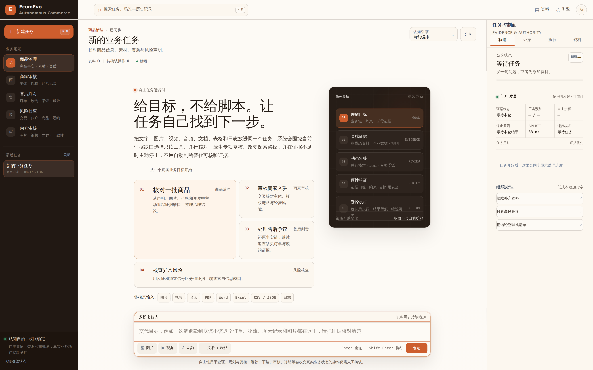
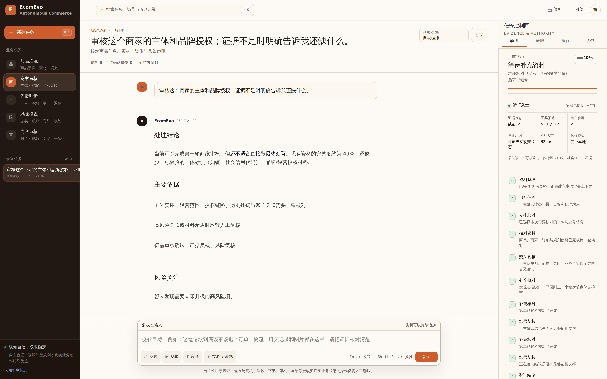
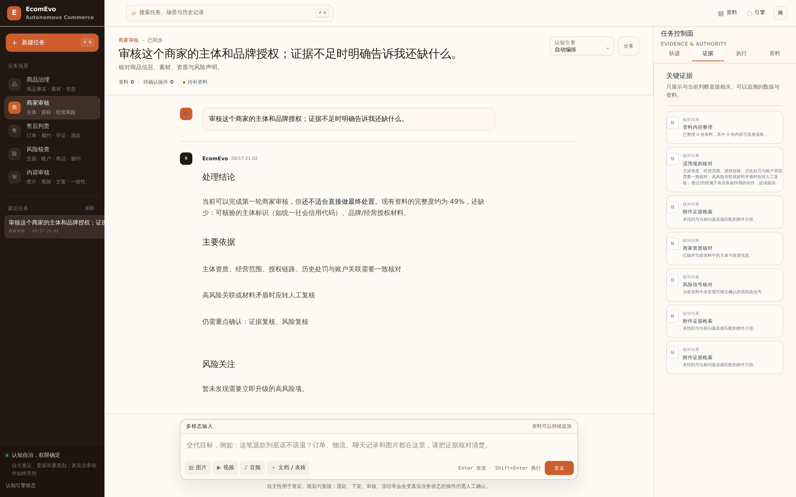
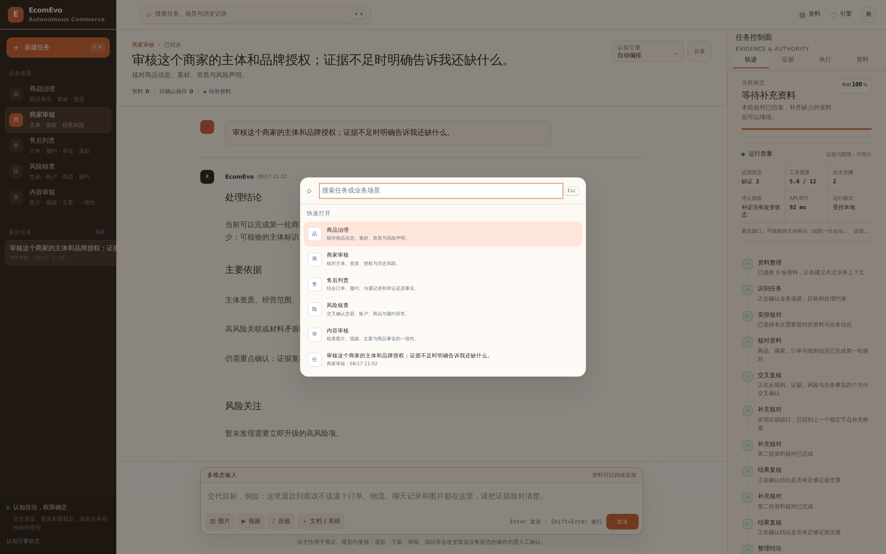
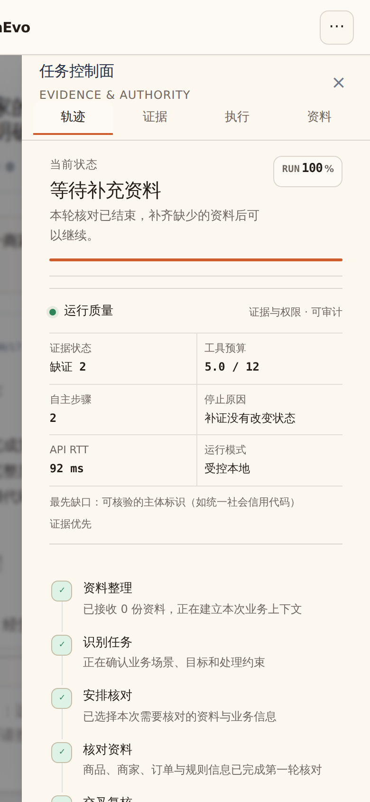
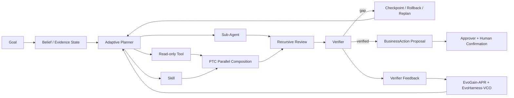

<p align="center"><sub>SELF-EVOLVING · EVIDENCE-GROUNDED · MODEL-AGNOSTIC AGENT HARNESS</sub></p>

<h1 align="center">EcomEvo</h1>

<p align="center"><strong>面向复杂电商决策的自主、自恢复、自进化 Agent Harness Runtime</strong></p>

<p align="center"><b>目标交给 Runtime · 证据交给 Verifier · 权限留给业务</b></p>

<p align="center">
  
  
  
  
</p>

<p align="center">
  <b><a href="docs/PRODUCT_MANUAL.md">产品手册</a> · <a href="docs/HARNESS_EVOLUTION.md">Harness 自进化</a> · <a href="docs/ALGORITHM.md">算法报告</a> · <a href="docs/TECHNICAL_MANUAL.md">技术手册</a> · <a href="docs/VERIFICATION_REPORT.md">验证报告</a></b>
</p>

<p align="center"><em><b>Give the Agent a goal, not a script.</b></em></p>

<br />

<p align="center">
  
</p>

<p align="center">
  <sub><b>真实产品运行截图</b> · Uvicorn + Playwright Chromium · 1920×1200 logical viewport · DPR 2 · 3840×2400 source PNG · 非 mockup / 非手绘 SVG</sub>
</p>

<br />

## EcomEvo 是什么

EcomEvo 不是一个“把模型接上几个工具”的聊天壳，也不是依靠单次 prompt 完成业务判断的 workflow。

它是一套面向**商品治理、商家审核、售后判责、风险核查、内容审核**等复杂决策场景的 **model-agnostic Agent Harness Runtime**。任务从 Goal 开始，在持续的 Evidence / Belief State 上运行；系统可以自主选择只读 Tool、Skill、Memory 与 Sub-Agent，检查反证、重规划、恢复失败、决定停止，并把真实 verifier outcome 反哺给 routing 与 Harness 自身。

但学习层始终不拥有业务权限。

> **认知自治，权限确定。**
>
> EcomEvo 可以学习“下一步怎样查得更好”，不能学习“怎样降低证据门槛”或“怎样获得更多执行权限”。

<br />

<table>
  <tr>
    <td width="25%" valign="top"><b>Evidence-native</b><br/><br/>图片、视频、音频、PDF、Office、表格、日志与企业数据进入统一证据状态，而不是只拼进一段 prompt。</td>
    <td width="25%" valign="top"><b>Autonomous Runtime</b><br/><br/>Goal、Belief、Task Graph、Tool、Skill、Memory、Sub-Agent、Stop State 都由 Runtime 持续维护。</td>
    <td width="25%" valign="top"><b>Self-Evolving Harness</b><br/><br/>跨任务优化 Prompt / Tool Strategy / Memory Retrieval / Delegation；候选进入 shadow，由真实 Verifier outcome 决定晋升或回滚。</td>
    <td width="25%" valign="top"><b>Deterministic Authority</b><br/><br/>Registry、Sandbox、Verifier、RBAC、Approval 与真实业务动作始终位于学习空间之外。</td>
  </tr>
</table>

<br />

## 产品 · 一面工作台承载完整决策链

对复杂业务任务来说，用户真正需要看的不是隐藏思维链，而是四类可审计状态：**目标是什么、证据到哪里了、Runtime 正在做什么、谁拥有最终权限**。

<table>
  <tr>
    <td width="50%" align="center" valign="top">
      
      <br/><br/>
      <sub><b>Runtime Control</b> · elapsed、budget、evidence gaps、routing state、stop reason 与 autonomy mode 都是结构化状态。</sub>
    </td>
    <td width="50%" align="center" valign="top">
      
      <br/><br/>
      <sub><b>Evidence Space</b> · 资料、缺口与验证状态进入同一任务，而不是散落在附件与聊天记录里。</sub>
    </td>
  </tr>
</table>

<br />

### 五类业务场景，共用同一条 Harness 运行链

| 场景 | Runtime 要解决的核心问题 |
| --- | --- |
| **商品治理** | 主图、详情、声明、品牌、价格与资质是否一致；证据不足时继续追证，而不是猜 |
| **商家审核** | 主体、授权链、经营范围、关联关系与历史风险能否形成可核验闭环 |
| **售后判责** | 订单、物流、沟通记录、图片/音频与规则怎样重建事实时间线 |
| **风险核查** | 弱线索、相关性、独立信号与反证如何分离，避免把“可疑”直接升级为“事实” |
| **内容审核** | 图片、视频、音频、文案与结构化资料如何进入同一个 verifier 流程 |

<table>
  <tr>
    <td width="50%" align="center" valign="top">
      
      <br/><br/><sub><b>Scene Runtime</b> · 场景变化改变 evidence schema，不改变安全与权限原则。</sub>
    </td>
    <td width="50%" align="center" valign="top">
      
      <br/><br/><sub><b>Command Surface</b> · 任务、场景与历史入口保持低摩擦，但不会绕过 Runtime 状态机。</sub>
    </td>
  </tr>
</table>

<br />

<table>
  <tr>
    <td width="62%" valign="middle">
      <h3>桌面是工作台，移动端仍然是同一个任务</h3>
      <p>窄屏不删除关键控制能力，而是重新组织空间。Evidence、运行状态、资料与待确认动作仍然属于同一个 durable conversation。</p>
      <p>多标签页也不依赖单进程内存同步：SQLite durable event log 才是跨 worker 的事件顺序来源。</p>
      <p><b>真实移动端回归：</b>390×844 logical viewport，DPR 2 输出 780×1688 产品截图。</p>
    </td>
    <td width="38%" align="center" valign="middle">
      
    </td>
  </tr>
</table>

<br />

## Runtime 设计 · Harness 是一等公民

EcomEvo 把模型看成 Harness 中可替换的认知组件，而不是产品本身。

### 01 · Runtime design

面向商品治理、商家审核、售后等复杂决策场景，构建**模型无关的 Agent Harness Runtime**；Model、Tool、Skill、Memory、Sandbox 与 Verifier 插件化，并由 Event-Sourced Runtime 统一维护任务状态与执行轨迹。

### 02 · Autonomous planning

Event-Sourced Runtime 管理 **Goal / Belief State / Task State**。Adaptive Planner 结合证据缺口、信息收益、成本与后验状态，自主选择 Skill、Tool、Sub-Agent 或终止；Recursive Harness 拆分并行认知子任务，PTC 组合并发只读工具调用。

### 03 · Verify, recover, evolve

Verifier 校验证据完备性、任务约束与工具副作用；Runtime 支持 **checkpoint / rollback / replan**。Failure-Driven Evolver 从失败与恢复轨迹提取可复用认知经验；Prompt、Tool Strategy、Memory 与 Delegation 的新候选进入 shadow，经 Sandbox / Verifier / Regression evidence 验证后才能晋升，使长链任务同时具备失败恢复、可回滚与跨任务自进化能力。

<br />



<br />

## 两个时间尺度的自进化

EcomEvo 不把“单次任务里选什么工具”和“未来 Harness 应该变成什么样”混成一个黑盒优化器。

<table>
  <tr>
    <td width="50%" valign="top">
      <b>EvoGain-APR · within-turn learning</b><br/><br/>
      在一次任务内部学习“此刻哪一个只读动作最值得做”。<br/><br/>
      Hierarchical Bayesian posterior · deterministic UCB · contextual abstention · verifier difference credit · tool reliability posterior。
    </td>
    <td width="50%" valign="top">
      <b>EvoHarness-VCO · across-turn evolution</b><br/><br/>
      跨真实任务学习“Harness 的哪一个认知组件应该改变”。<br/><br/>
      Typed component edits · block-coordinate search · post-candidate cohort · posterior shadow allocation · promote / rollback。
    </td>
  </tr>
</table>

它们共同优化认知效率，但共享同一条不可学习的权限边界：

$$
\boxed{
\max_{\pi_\theta,\,H}
\;\mathbb E[R_{\mathrm{evidence}}]
\qquad
\text{s.t.}\quad
 a_t\in\mathcal A^{\mathrm{safe}}(s_t)
}
$$

<br />

## EvoHarness-VCO · 2026 Harness Self-Evolution

### Verifier-grounded Coordinate Optimizer

EvoHarness-VCO 的设计目标不是让模型“随便改自己的代码”，而是让 Harness 成为**可观测、可编辑、可验证、可回滚的外部学习状态**。

生产 Runtime 中可进化的是：

$$
\boxed{
\mathcal H_{\mathrm{learn}}
=
\{H_{prompt},H_{tool},H_{memory},H_{delegation}\}
}
$$

而以下组件根本不进入 optimizer 的表示空间：

$$
\boxed{
\mathcal H_{\mathrm{authority}}
=
\{Registry,Sandbox,Verifier,RBAC,Approval,BusinessAction\}
}
$$

所以安全不是 reward 的一项权重；**安全先定义可行域，优化器只在可行域内部学习。**

### 1 · Typed, bounded component edits

Harness candidate 不是任意 Python patch，而是受类型约束的 declarative edit：

```text
prompt      -> guidance

tool        -> preferred_tools / avoid_tools

memory      -> retrieval_terms / guidance

delegation  -> roles / guidance
```

允许的 mutation 只有：

```text
add | delete | replace
```

Tool mutation 还必须经过当前 Registry metadata 与 Sandbox，只允许 read-only / mcp-read 工具。没有 reasoner 时，Tool candidate 仍可由**当前 verifier gaps × 当前工具 purpose/evidence tags**自动诱导，不维护“某业务词固定映射某工具”的手写业务价值表。

### 2 · Block-coordinate evolution

设 Harness 为 $K$ 个认知组件：

$$
H_t=\left(H_t^{(1)},H_t^{(2)},\ldots,H_t^{(K)}\right)
$$

每一轮只进化一个 coordinate $k_t$，其它组件保持不变：

$$
\boxed{
H_{t+1}^{(j)}=H_t^{(j)},\qquad j\neq k_t
}
$$

一个 domain 同时最多存在一个 shadow candidate。这样可以把真实 outcome 归因到具体 Harness 改动，降低多组件同时变异带来的交叉干扰与过拟合。

### 3 · Verifier harmonic potential

候选不能靠 optimizer model 自评“我变强了”。Fitness 来自真实 Decision Verifier。

设 verifier quality 为 $q(v)$，evidence completeness 为 $c(v)$：

$$
\boxed{
\Phi(v)
=
\frac{2q(v)c(v)}{q(v)+c(v)+\epsilon}
}
$$

只要任一项低，reward 就被压低；一段听起来很好的回答无法补偿证据缺口。

每个 Harness component 用 fractional Beta posterior 累积真实任务 outcome：

$$
\alpha_h\leftarrow\alpha_h+\Phi(v),
\qquad
\beta_h\leftarrow\beta_h+1-\Phi(v)
$$

$$
\mathbb E[\theta_h]
=
\frac{\alpha_h}{\alpha_h+\beta_h}
$$

### 4 · Post-candidate cohort

新 candidate 不能拿自己的几次新结果去对比 parent 多个月的历史 posterior。

设 candidate 创建时刻为 $t_0$，只比较 $t_0$ 之后的两臂 outcome：

$$
\mathcal D_{h'}
=\{v_i\mid component=h',\;t_i\ge t_0\}
$$

$$
\mathcal D_h
=\{v_i\mid component=h,\;t_i\ge t_0\}
$$

两臂都出现实际 exposure 之前，不允许 promote / reject。这是统计可识别性约束，不是“必须跑固定 N 次”的人工门槛。

### 5 · Posterior-derived shadow allocation

EcomEvo 不配置“固定 10% shadow 流量”。候选使用概率直接来自后验优越概率：

$$
\boxed{
p_t
=P\!\left(\theta_{h'}>\theta_h\mid\mathcal D_{t\ge t_0}\right)
}
$$

$$
P(\mathrm{use}\;h')=p_t
$$

任务分桶由 `hash(session_id, candidate_id)` 做 deterministic assignment，因此相同 session 与 candidate 可以稳定回放。

### 6 · Sequential promote / rollback

令 $\rho$ 为统计决策风险：

$$
\boxed{
p_t\ge1-\rho\Rightarrow\mathrm{promote}}
$$

$$
\boxed{
p_t\le\rho\Rightarrow\mathrm{rollback}}
$$

其余状态继续 shadow。**没有固定 run-count 晋升规则，也没有把一组手工业务价值权重永久写死成最终策略。**

> 完整实现、研究映射、组件类型、posterior cohort 与安全边界见 **[Harness Self-Evolution](docs/HARNESS_EVOLUTION.md)**。

<br />

## 2026 方法谱系 · 复现核心机制，再适配垂直业务

EvoHarness-VCO 不是把一个 coding-agent 算法原样搬进电商，而是选择 2026 最新公开工作的关键机制，再按 evidence-governed commerce runtime 重组：

| 2026 工作 | 复现/吸收的核心思想 | EcomEvo 的垂直适配 |
| --- | --- | --- |
| **Microsoft SkillOpt** | frozen model 外部 text-space parameter；bounded add/delete/replace；validation gate；rejected-edit memory | 从单 Skill 扩展到 Prompt / Tool Strategy / Memory / Delegation；业务权限不进入可编辑文本状态 |
| **AHE · Agentic Harness Engineering** | component / experience / decision observability；Harness edit 可审计、可回滚 | 所有 component、hypothesis、parent、generation、outcome 与 transition 持久化，并写入 Runtime event stream |
| **HarnessCompass** *(2026 preprint)* | constrained evolution；task-agnostic changes；component-wise optimization | 一个 domain 同时只进化一个 cognitive coordinate，避免跨组件 attribution 污染 |
| **SBCO** *(2026 preprint)* | verifier-grounded approximate block-coordinate harness optimization | 用业务 Decision Verifier 作为自监督反馈，而不是依赖 coding test 或模型自评分 |

参考：

- [Microsoft SkillOpt — official open source](https://github.com/microsoft/SkillOpt)
- [Microsoft Research — SkillOpt](https://www.microsoft.com/en-us/research/publication/skillopt-executive-strategy-for-self-evolving-agent-skills/)
- [Agentic Harness Engineering — paper](https://arxiv.org/abs/2604.25850)
- [Agentic Harness Engineering — official code](https://github.com/china-qijizhifeng/agentic-harness-engineering)
- [HarnessCompass — arXiv:2608.01918](https://arxiv.org/abs/2608.01918)
- [SBCO — arXiv:2608.10157](https://arxiv.org/abs/2608.10157)

HarnessCompass 与 SBCO 截至 2026-08 是最新公开预印本；这里明确按 preprint 引用，不虚构正式顶会录用。EcomEvo 声明的是**方法核心的工程化复现与垂直领域再设计**，不是与原项目逐行同构。

<br />

## EvoGain-APR · 单任务内自适应路由

EvoHarness-VCO 改善长期 Harness；EvoGain-APR 则负责每一轮实时选择合法的 read-only cognition action。

### Hierarchical Bayesian posterior

对候选工具构造上下文向量 $x$，真实 verifier difference credit 以 round 为单位更新：

$$
A_t
=A_0+\delta(A_{t-1}-A_0)+\sum_i x_i x_i^\top
$$

$$
b_t
=b_0+\delta(b_{t-1}-b_0)+\sum_i r_i x_i
$$

$$
\mu_t=A_t^{-1}b_t,
\qquad
\sigma_t^2(x)=x^\top A_t^{-1}x
$$

不同业务域通过有界 global → domain shrinkage 共享经验：

$$
\tau_d=\frac{n_d}{n_d+\lambda}
$$

### Deterministic UCB

$$
\boxed{
Q_t(x)
=\mu_t^\top x
+\beta_t\sqrt{x^\top A_t^{-1}x}
}
$$

探索来自 posterior uncertainty，而不是不可回放的随机工具选择。

### Contextual abstention

Runtime 不只要学会“选什么”，还要学会“什么时候不值得继续查”。

$$
\boxed{
\mathrm{Adv}_t(a_i\mid s_t)
=Q_t(x_i)-Q_t(x_{\varnothing}(s_t))
}
$$

只有：

$$
\mathrm{Adv}_t(a_i\mid s_t)>0
$$

候选才进入执行集合。

### Verifier difference credit

对每个已执行结果 $r_i$ 做 leave-one-out counterfactual：

$$
D_i
=\Phi(V(R))-\Phi(V(R\setminus\{r_i\}))
$$

再按成本归一：

$$
\boxed{
\mathrm{Credit}_i
=\frac{D_i}{1+\mathrm{Cost}_i}
}
$$

因此 routing posterior 学到的是**工具对可验证状态的真实边际贡献**，而不是模型主观评价。

> 详细 feature space、adaptive activation、non-stationary decay、counterfactual learning 与性能实现见 **[算法报告](docs/ALGORITHM.md)**。

<br />

## Failure recovery · 先恢复当前任务，再进化未来 Harness

```text
Goal / Belief
    │
    ▼
Adaptive Plan
    │
    ▼
Read-only Tool / Skill / Sub-Agent
    │
    ▼
Verifier
    ├── pass ──> Controlled Action Proposal
    │
    └── fail
          │
          ▼
    Checkpoint / Rollback / Replan
          │
          ▼
    Failure / Recovery Trajectory
          │
          ├── Skill distillation
          └── Harness coordinate candidate
                    │
                    ▼
             Shadow posterior
                    │
          ┌─────────┴─────────┐
          ▼                   ▼
       Promote             Rollback
```

这里有一个重要区分：**当前任务的失败恢复不能等待“未来学会”**。Runtime 先依靠 Verifier 与 deterministic recovery 保证本轮安全；跨任务 optimizer 再从已验证轨迹中提取可泛化改进。

<br />

## Authority · 学习器永远不能给自己加权限

模型、Memory、Skill 与 Harness candidate 都不能成为独立业务证据，也不能改变业务动作的合法性。

```text
Adaptive Cognition
        │
        ▼
Read-only Tool / Skill / Specialist
        │
        ▼
Decision Verifier
════════════════════════════════════
Deterministic Authority Boundary
        │
        ▼
BusinessAction Proposal
        │
        ▼
Approver Identity + Human Confirmation
        │
        ▼
Business Executor
```

对 timeout、断网、HTTP 5xx/408、损坏响应等无法确认副作用是否发生的企业工具异常，EcomEvo 使用 `uncertain` 语义，禁止把“结果未知”伪装成“明确失败，可以盲目重试”。

<br />

## Durable Runtime · 进程退出不等于任务丢失

一次 autonomous turn 使用闭合的 evidence snapshot：

```text
User Message
    │
    ▼
Atomic Message + Accepted Event + Durable Job
    │
    ▼
Immutable Input / Asset SHA Snapshot
    │
    ▼
Cross-process Lease
    │
    ▼
Autonomous Runtime
    │
    ▼
Atomic Assistant Message + Proposals + Terminal Event
```

- user message + accepted event + durable job 原子提交；
- active turn 阻止 evidence mutation；
- worker crash 后过期 lease 可 reclaim；
- SQLite `task_events` 是跨 worker authoritative event source；
- process-local queue 只是低延迟 wake hint；
- WebSocket 支持 `after_id` 增量恢复与跨 worker ordered catch-up。

<br />

## Tenant · RBAC · Approval Audit

```text
viewer  <  operator  <  approver  <  admin
```

- tenant-scoped conversation / asset / action 不暴露其他租户资源存在性；
- action decision 要求 `approver`；
- runtime / evolution 全局控制面要求 `admin`；
- approval CAS 自动持久化 actor tenant / user / role / auth mode；
- hardened HMAC mode 面向 trusted reverse proxy / SSO / gateway 边界；
- server secret 永远不会进入浏览器。

具体企业 IdP 属于真实部署集成，不会在仓库里伪造“已完成”。

<br />

## Automated release gates

<table>
  <tr>
    <td width="33%" valign="top"><b>Regression</b><br/><br/>Full pytest、Gold Set fresh + persisted replay、adversarial authority、Harness cohort regression、durable recovery、tenant/RBAC、MCP uncertainty、WebSocket ordering、frontend structure。</td>
    <td width="33%" valign="top"><b>Pressure</b><br/><br/>Current-head <code>1 / 8 / 32 / 64 / 120 / 240</code> 并发，检查 session uniqueness、event chain、budget、stop reason 与 side-effect invariants。</td>
    <td width="34%" valign="top"><b>Real Chromium E2E</b><br/><br/>真实 Uvicorn + Chromium，覆盖首屏、发送与 durable result、Runtime Pulse、Evidence、Command Palette、390×844 mobile drawer、双标签同步与 console/page error。</td>
  </tr>
</table>

成功 E2E 还会生成 README 使用的真实产品截图；桌面截图以 **3840×2400** 保存到 `docs/images/real/`。因此 README 的产品视觉与真正通过浏览器门禁的产品页面来自同一条运行链。

<br />

## Quick Start

```bash
python -m venv .venv
source .venv/bin/activate
python -m pip install -e .
cp .env.example .env
uvicorn ecomevo.api.app:app --host 0.0.0.0 --port 8000
```

打开：

```text
http://localhost:8000
```

### Docker

```bash
docker build -t ecomevo .
docker run --rm \
  -p 8000:8000 \
  --env-file .env \
  -v ecomevo-data:/app/outputs \
  ecomevo
```

### Model-agnostic cognition layer

模型层是可替换插件，不拥有业务执行权。兼容端点可以通过环境变量接入：

```bash
OPEN_MODEL_BASE_URL=http://your-runtime/compatible-endpoint
OPEN_MODEL_API_KEY=your-key
OPEN_MODEL_MODEL=your-current-model
OPEN_MODEL_MULTIMODAL=0
```

更换底层模型不要求修改 Verifier、Sandbox、RBAC、BusinessAction authority，也不要求重写 EvoHarness-VCO / EvoGain-APR 的安全边界。

<br />

## Documentation

| 文档 | 内容 |
| --- | --- |
| **[产品手册](docs/PRODUCT_MANUAL.md)** | 任务、证据、运行状态、场景、上传与审批体验 |
| **[Harness Self-Evolution](docs/HARNESS_EVOLUTION.md)** | 2026 Harness 方法谱系、EvoHarness-VCO、component posterior、shadow / promote / rollback |
| **[算法报告](docs/ALGORITHM.md)** | EvoGain-APR、Bayesian routing、UCB、abstention、difference credit、复杂度 |
| **[技术手册](docs/TECHNICAL_MANUAL.md)** | API、durable job、MCP、identity/RBAC、恢复与部署 |
| **[架构](docs/ARCHITECTURE.md)** | 系统组件、数据流、learning plane 与 deterministic authority boundary |
| **[性能](docs/PERFORMANCE.md)** | current-head pressure、routing-store benchmark、瓶颈与范围 |
| **[验证报告](docs/VERIFICATION_REPORT.md)** | CI、Gold Set、压力、Chromium E2E 与真实环境边界 |
| **[设计系统](docs/DESIGN.md)** | 中文排版、动效、响应式、任务工作台与交互原则 |

<br />

## 真实边界

仓库内可自动化的发布门禁可以证明代码在受控环境中的行为，但不会把外部生产条件包装成“已经验证”：

- 企业 IdP / SSO / Gateway 的实际接入；
- 真实 provider / MCP 凭证、区域、quota/rate limit、schema drift 与下游幂等；
- Safari / Microsoft Edge 实机；
- 大型或畸形 PDF、Office、图片、视频与音频业务语料；
- 超过 SQLite WAL 单 writer 边界后的生产多节点数据库 / queue topology；
- 由真实业务团队持续扩展和裁决的 Gold Set。

<br />

<h2 align="center">EcomEvo</h2>

<p align="center"><b>目标交给 Runtime。证据交给 Verifier。权限留给业务。</b></p>

<p align="center"><b>Self-evolving cognition. Deterministic authority.</b></p>

<p align="center"><sub>Build a harness that can learn how to work better — without learning how to bypass control.</sub></p>
