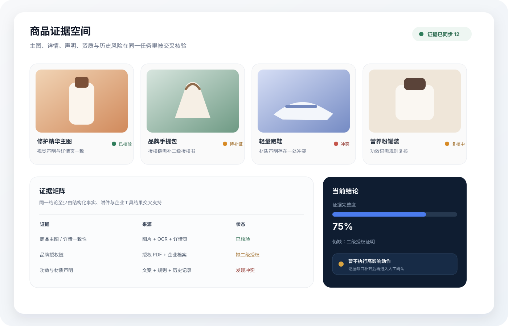
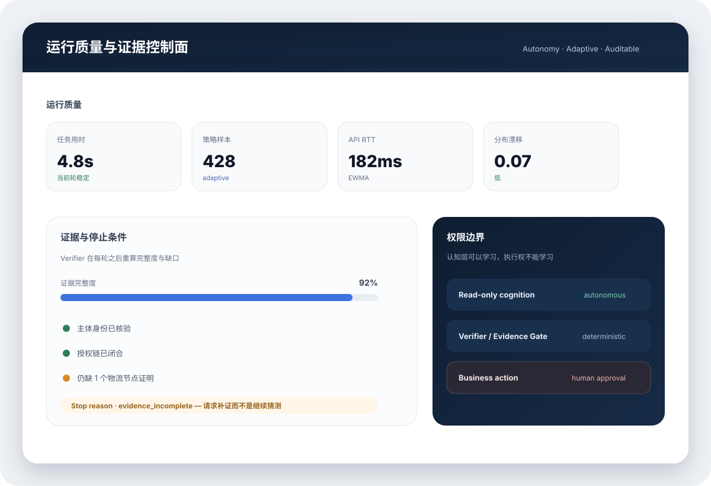
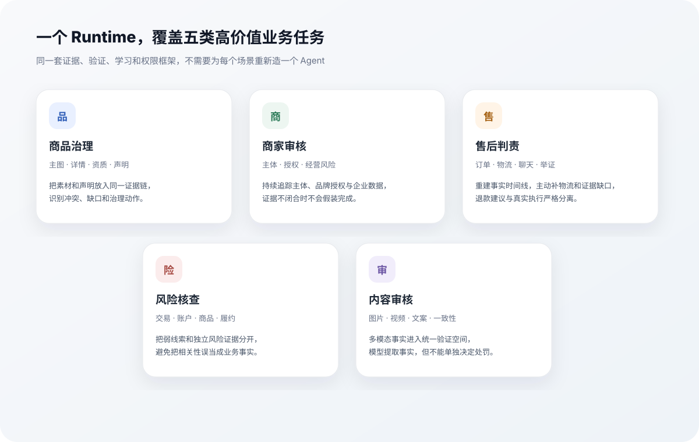

<p align="center"><sub>EVIDENCE-GOVERNED COMMERCE DECISION WORKBENCH</sub></p>

<h1 align="center">EcomEvo</h1>

<p align="center"><strong>把复杂电商业务，从“问 AI”推进到“持续查证、组织证据、形成可执行决策”。</strong></p>

<p align="center">
  目标进入任务 · 证据持续累积 · 结论可回溯 · 高影响动作始终受控
</p>

<p align="center">
  
  
  
  
  <a href="https://github.com/jiaweine/EcomEvo-Harness/pull/3"></a>
</p>

<p align="center">
  <b>
    <a href="#当前状态">当前状态</a> ·
    <a href="#main-当前已经能做什么">当前能力</a> ·
    <a href="#quick-start">Quick Start</a> ·
    <a href="docs/ARCHITECTURE.md">架构</a> ·
    <a href="docs/VERIFICATION_REPORT.md">验证</a>
  </b>
</p>

<br />

<p align="center">
  
</p>

<p align="center">
  <sub><b>EcomEvo 商业决策工作台</b> · 把目标、对话、多模态资料、判断依据和待确认业务动作放进同一个持续任务。</sub>
</p>

<br />

## EcomEvo 是什么

EcomEvo 是一个面向电商运营、审核与治理场景的 **evidence-governed decision harness**。

它不是只负责生成答案的聊天框，也不是收到一句自然语言指令就直接修改业务状态的自动执行器。EcomEvo 把一次业务问题组织成一个持续任务：用户可以不断补充商品、商家、订单、截图、视频、音频、文档、表格和日志，系统持续整理事实、发现证据缺口、调用只读工具核对、形成结论，并把真正会改变业务状态的动作单独交给用户确认。

核心原则只有一句：

> **认知可以自动化，业务权限必须确定。**

用户不需要看到模型的隐藏思维链，但应该始终能够看清：**用了哪些资料、关键依据是什么、还缺什么、当前处理到哪里、哪些动作正在等待确认。**

---

## 当前状态

这个仓库同时包含一个已经可运行的 `main` 产品，以及一个仍在开发验证中的 Adaptive Runtime 方向。两者需要明确区分。

| 范围 | 状态 | 说明 |
| --- | --- | --- |
| **`main`** | 可运行 | 三栏业务工作台、持续任务、多模态资料、证据核对、受控业务动作、多服务接入、任务恢复与留痕 |
| **Adaptive Runtime · PR #3** | Draft / 开发中 | 受约束自主查证、Adaptive Posterior Routing、跨任务 Harness 演化、durable execution、RBAC 与更完整的企业运行边界 |

> `PR #3` 描述的是下一阶段能力，不代表 `main` 已经包含其中全部实现。

---

## main 当前已经能做什么

<table>
  <tr>
    <td width="50%" valign="top">
      <b>持续任务空间</b><br/><br/>
      同一任务可以跨多轮持续追加资料、追问和修改目标，不需要每次重新描述业务背景。
    </td>
    <td width="50%" valign="top">
      <b>多模态证据</b><br/><br/>
      图片、视频、音频、PDF、Office、表格、日志和结构化业务数据可以进入同一个任务。
    </td>
  </tr>
  <tr>
    <td width="50%" valign="top">
      <b>证据优先</b><br/><br/>
      系统区分事实、依据、缺口、冲突和普通线索；资料不足时优先要求补证据，而不是强行给出确定结论。
    </td>
    <td width="50%" valign="top">
      <b>高影响动作受控</b><br/><br/>
      退款、下架、商家审核、风险升级等改变业务状态的操作先形成待确认项，再进入执行。
    </td>
  </tr>
  <tr>
    <td width="50%" valign="top">
      <b>模型与业务控制分离</b><br/><br/>
      模型负责推理和多模态理解；任务状态、证据门槛、工具调用边界、确认与执行留痕由 EcomEvo Runtime 管理。
    </td>
    <td width="50%" valign="top">
      <b>恢复与审计</b><br/><br/>
      任务、资料、运行事件、待确认动作和执行结果可追踪；网络或工具异常后可以基于已保存状态继续处理。
    </td>
  </tr>
</table>

### 工作流


---

## 产品工作台

### 一面工作台，看完整任务，而不是只看一段对话

<p align="center">
  
</p>

<p align="center">
  <sub><b>Evidence Space</b> · 商品主图、详情、资质、授权、声明与历史风险被组织在同一个证据空间。</sub>
</p>

<table>
  <tr>
    <td width="52%" align="center" valign="top">
      
      <br/><br/>
      <sub><b>Runtime Control</b> · 处理进度、关键依据、任务资料和待确认动作是产品状态，而不是藏在一段模型回答里。</sub>
    </td>
    <td width="48%" valign="middle">
      <h3>从“答案”转向“业务闭环”</h3>
      <p>任务里同时存在目标、资料、事实、依据、缺口、判断与待确认动作。</p>
      <p>用户可以继续补资料、追问、纠正目标，系统仍然围绕同一个任务上下文推进。</p>
      <p>真正改变业务状态的动作与认知过程保持明确边界。</p>
    </td>
  </tr>
</table>

---

## 适用场景

<p align="center">
  
</p>

| 场景 | 典型任务 |
| --- | --- |
| **商品治理** | 核对标题、主图、详情、功效声明、品牌与资质，识别下架或补件项 |
| **商家审核** | 核对主体、经营范围、资质、授权链与历史风险，形成准入建议 |
| **售后判责** | 结合订单、物流、沟通记录和用户举证重建事实时间线，形成责任与退款建议 |
| **风险核查** | 交叉确认交易、账户、商品与履约异常，区分强证据、弱线索和反证 |
| **内容审核** | 检查图片、视频、音频、文案与结构化商品事实的一致性 |

---

## Quick Start

要求：

- Python 3.11+
- 建议使用虚拟环境
- 外部模型服务按需配置；不配置外部服务也可以使用本地演示模式验证基本业务流程

```bash
python -m venv .venv
source .venv/bin/activate

python -m pip install -e .
cp .env.example .env

uvicorn ecomevo.api.app:app --host 0.0.0.0 --port 8000
```

打开：

```text
http://localhost:8000
```

### Docker

```bash
docker build -t ecomevo .

docker run --rm \
  -p 8000:8000 \
  --env-file .env \
  -v ecomevo-data:/app/outputs \
  ecomevo
```

### 外部服务与数据流向

外部模型、OpenAI-compatible endpoint 和企业 MCP 按配置启用。选择外部服务时，当前任务内容和需要处理的资料会按照你的配置发送到对应服务。

高影响业务动作不会因为切换模型或服务而绕过 EcomEvo 的确认边界。

---

## 验证

```bash
pytest -q
python scripts/e2e_smoke.py
```

真实本地网络层：

```bash
uvicorn ecomevo.api.app:app --host 127.0.0.1 --port 8000
python scripts/live_smoke.py --base http://127.0.0.1:8000
```

当前主分支自动化回归 **136 项通过**，并覆盖业务反例、长任务、并发确认、多模态证据、异常上传、任务恢复、MCP、真实 HTTP / WebSocket、安全响应头和响应式前端。

完整范围与已知边界见 **[docs/VERIFICATION_REPORT.md](docs/VERIFICATION_REPORT.md)**。

---

## 架构概览

```text
frontend/
    客户工作台：任务、对话、资料、进度、关键依据、待确认动作

ecomevo/api/
    FastAPI / WebSocket / 会话 / 附件 / 动作确认 / 恢复

ecomevo/product/
    多模态资料处理 / 产品编排 / 客户结果组织

ecomevo/providers/
    模型与多厂商服务适配

ecomevo/runtime/
    事件状态 / Planner / Tools / Review / Verifier / Evolver / MCP
```

关键边界：

- **模型不是业务状态控制器。**
- **工具调用必须经过 Runtime 边界。**
- **资料不足不能被模型文案覆盖成“已验证”。**
- **高影响动作与认知层分离。**
- **执行结果必须回写任务并保留审计轨迹。**

详细说明见 **[docs/ARCHITECTURE.md](docs/ARCHITECTURE.md)**。

---

## Adaptive Runtime · 下一阶段

> **状态：Draft PR #3。以下能力正在开发和验证，不作为 `main` 当前完成度的承诺。**

下一阶段 EcomEvo 会从“持续任务工作台”推进到一个 **受约束的自主证据获取 Runtime**：

- 根据当前证据状态决定下一步查什么，而不是固定执行一套工具链；
- 把“继续查证 / 查反证 / 停止”纳入显式决策；
- 用可验证结果而不是模型自评分来更新工具与策略价值；
- 让 Prompt、只读 Tool Strategy、Memory Retrieval、Delegation 等认知组件可以被评估和演化；
- Registry、Sandbox、Verifier、RBAC、Approval 和真实 BusinessAction 权限不进入学习空间。

设计原则仍然不变：

> **Adaptive cognition. Deterministic authority.**

完整设计、实现与 release gate 进展见 **[Adaptive Runtime · PR #3](https://github.com/jiaweine/EcomEvo-Harness/pull/3)**。

---

## 产品原则

<table>
  <tr>
    <td width="33%" valign="top">
      <b>01 · 证据优先</b><br/><br/>
      模型输出不是天然事实。结论应该能回到材料、结构化数据或企业工具结果。
    </td>
    <td width="33%" valign="top">
      <b>02 · 自主认知不等于自主权限</b><br/><br/>
      系统可以自动化和学习如何查证，但不能因此获得更多业务权限。
    </td>
    <td width="34%" valign="top">
      <b>03 · 产品状态必须可见</b><br/><br/>
      用户不需要隐藏思维链，但需要知道证据、缺口、处理状态、待确认动作和执行结果。
    </td>
  </tr>
</table>

---

## 生产边界

当前工程更适合作为企业内部工作台 / Harness 基础工程继续集成。

正式公网或生产环境建议：

- 放在企业 SSO / API Gateway / 反向代理之后；
- 对真实退款、下架、冻结、审核等动作继续实施最小权限和幂等控制；
- 使用真实厂商凭据、企业 MCP、目标网络拓扑和目标浏览器做独立验证；
- 把当前仓库的自动化测试视为工程行为验证，而不是外部生产环境背书。

仓库不会把尚未使用真实凭据或真实企业系统验证的部分描述成“已经线上通过”。

---

## 文档

| 文档 | 重点 |
| --- | --- |
| **[ARCHITECTURE](docs/ARCHITECTURE.md)** | 当前主分支架构与组件边界 |
| **[DESIGN](docs/DESIGN.md)** | 产品 UI、响应式、中文排版与交互原则 |
| **[VERIFICATION REPORT](docs/VERIFICATION_REPORT.md)** | 当前主分支验证记录 |
| **[Adaptive Runtime · PR #3](https://github.com/jiaweine/EcomEvo-Harness/pull/3)** | 自主 Runtime、Adaptive Routing、Harness Evolution、durable execution 与 RBAC |

<br />

---

<p align="center"><b>EcomEvo</b></p>
<p align="center"><strong>把复杂任务组织成证据，把自主认知约束在权限边界之内。</strong></p>
<p align="center"><sub>Evidence first. Controlled action. Adaptive cognition.</sub></p>
