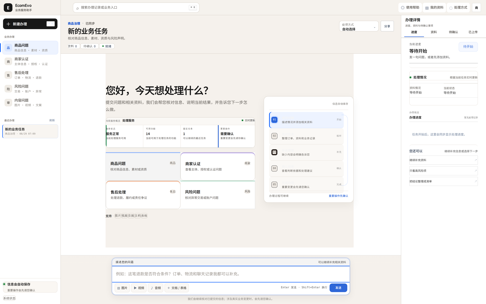
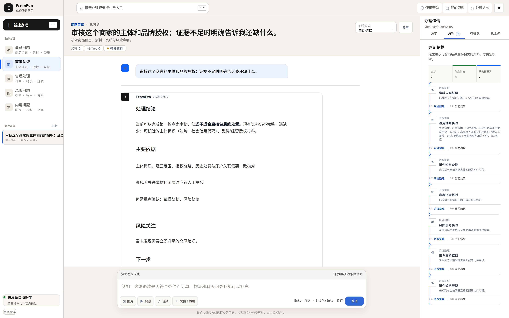
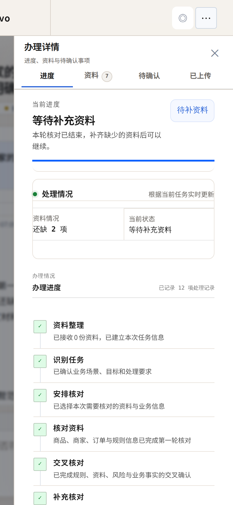

<div align="center">

# EcomEvo

### 复杂电商业务，一次说清，持续处理

**把商品、商家、售后、风险和内容问题放进同一个办理空间。**  
问题、资料、处理结果、判断依据、办理进度和待确认事项始终在一起，不需要在多个页面和聊天记录之间来回拼信息。

</div>

<p align="center">
  <a href="./docs/images/product-customer-overview.png">
    
  </a>
</p>

<p align="center"><sub>业务服务工作台 · 点击查看 3840 × 2400 高清原图</sub></p>

---

## 一件复杂的事，也可以按一条线处理

EcomEvo 面向真实电商业务中的复杂问题。您只需要说明情况并提交相关资料，系统会持续整理当前信息、指出还缺什么、给出处理结果，并把需要您确认的事项单独放出来。

| 您要做的事 | EcomEvo 帮您完成 |
|---|---|
| **说明问题** | 从商品、商家、售后、风险或内容场景开始，直接描述希望解决的事情 |
| **添加资料** | 把图片、视频、音频、文档、表格和业务记录放进同一次办理 |
| **查看结果** | 看到当前结论、主要依据、风险关注和下一步建议 |
| **继续补充** | 资料不够时直接告诉您缺什么，补充后沿着原任务继续处理 |
| **确认操作** | 涉及真实业务状态变化时，先说明影响，再由您决定是否继续 |

---

## 适合这些电商场景

| 场景 | 可以怎么用 |
|---|---|
| **商品问题** | 核对商品信息、主图、详情、品牌声明与资质，定位不一致和资料缺口 |
| **商家认证** | 整理主体信息、授权关系、认证材料与经营信息，明确还需要补什么 |
| **售后处理** | 汇总订单、物流、聊天和媒体资料，梳理争议点、处理依据和下一步 |
| **风险问题** | 汇总异常交易、账户和关联信息，区分已确认事实与需要继续核对的线索 |
| **内容问题** | 核对图片、视频和文案的一致性，发现误导、违规和资料缺失问题 |

---

## 结果不只是一段回复

处理完成后，结果和它所依据的资料会放在同一个任务里。您可以继续追问，也可以直接查看右侧的资料、待确认事项和已上传内容。

<p align="center">
  <a href="./docs/images/product-customer-evidence.png">
    
  </a>
</p>

<p align="center"><sub>处理结果与判断依据 · 点击查看 3840 × 2400 高清原图</sub></p>

---

## 办理过程会一直跟着这件事

EcomEvo 把每一次补充、处理和确认都留在当前任务中。页面刷新、继续办理或补交资料时，不需要重新从头解释背景。

| 您看到的内容 | 作用 |
|---|---|
| **当前进度** | 知道这件事现在进行到哪里 |
| **资料情况** | 知道已经有哪些资料、还缺哪些内容 |
| **判断依据** | 知道当前结果参考了什么信息 |
| **待您确认** | 把会影响真实业务状态的操作单独列出来 |
| **办理记录** | 后续继续处理时，保留前面的上下文和处理过程 |

---

## 移动端也能继续看进度

办理详情在窄屏下会变成独立侧栏，进度、资料和待确认事项仍然保持清晰。

<p align="center">
  <a href="./docs/images/product-customer-mobile.png">
    
  </a>
</p>

<p align="center"><sub>移动端办理详情 · 点击查看高清原图</sub></p>

---

## 为什么适合复杂业务

| 体验 | 您得到的好处 |
|---|---|
| **一个任务持续处理** | 不用每一轮重新解释背景，也不用自己拼接上下文 |
| **资料和结果放在一起** | 处理依据更容易核对，后续补充也有明确位置 |
| **缺少什么直接说明** | 信息不足时先补关键内容，不用猜系统为什么没有给出结果 |
| **重要操作先确认** | 涉及退款、下架、审核结论、风险升级等真实变更时，由有权限的人确认 |
| **状态表达清楚** | 已完成、待补资料、待确认等状态分开呈现，方便继续推进 |

---

## 使用与部署

完整的产品使用说明见 [产品手册](docs/PRODUCT_MANUAL.md)，部署方式见 [部署指南](docs/DEPLOYMENT.md)。

<details>
<summary><b>本地启动</b></summary>

### macOS / Linux

```bash
git clone https://github.com/jiaweine/EcomEvo-Harness.git
cd EcomEvo-Harness
python -m venv .venv
source .venv/bin/activate
python -m pip install -e .
cp .env.example .env
uvicorn ecomevo.api.app:app --host 0.0.0.0 --port 8000
```

### Windows PowerShell

```powershell
git clone https://github.com/jiaweine/EcomEvo-Harness.git
cd EcomEvo-Harness
python -m venv .venv
.venv\Scripts\Activate.ps1
python -m pip install -e .
Copy-Item .env.example .env
uvicorn ecomevo.api.app:app --host 0.0.0.0 --port 8000
```

打开 `http://localhost:8000` 即可进入 EcomEvo。

</details>

---

<div align="center">

**EcomEvo · 让复杂电商问题有清晰的办理过程。**

</div>
