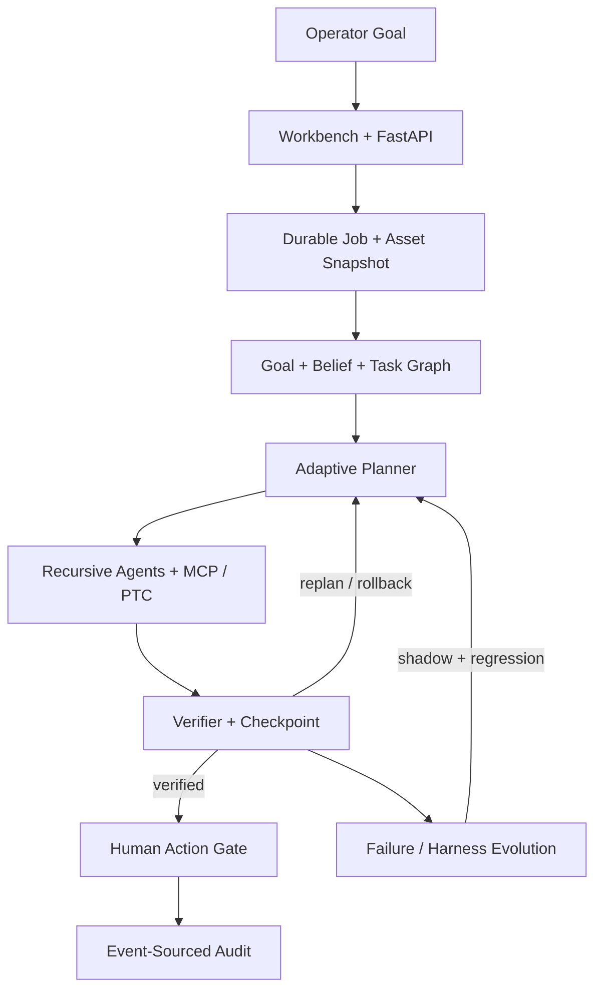
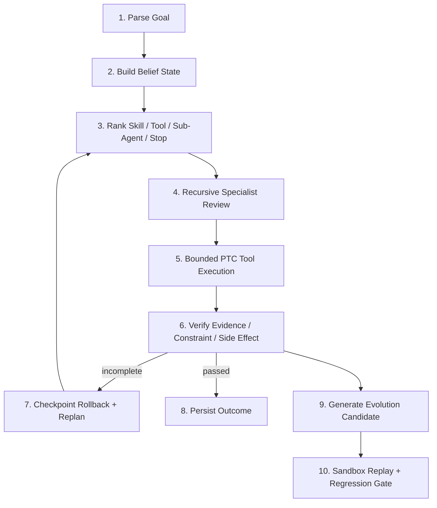
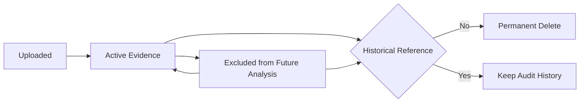

<div align=center>

# EcomEvo

### Evidence-Driven Commerce Decision Workbench

**不是把模型接进聊天框，而是把电商业务目标、资料、证据、判断和动作组织成一条可复核、可确认、可恢复的持续任务。**

`PLUGIN RUNTIME` · `EVENT SOURCING` · `ADAPTIVE PLANNER` · `RECURSIVE AGENT` · `MCP / PTC` · `VERIFIER` · `HARNESS EVOLUTION`

商品、商家、订单、内容与多模态资料进入同一个任务空间；系统持续形成证据和判断，高影响业务动作始终经过明确确认并保留执行结果。

</div>


---

## Product Thesis · 从问 AI 变成完成一次商业判断

**目标解析 → Belief State → 自主规划 → 递归子 Agent → 工具执行 → 验证回滚 → Harness 演进**

| CONTROL | TRUST | CONTEXT | EXECUTION |
|---|---|---|---|
| **权限可控**：退款、下架、审核、风险升级等高影响动作进入明确确认边界 | **结论可核验**：关键判断回到资料、结构化数据、工具结果与可验证状态 | **任务可持续**：消息、资料、证据、进度和动作属于同一个持续任务 | **执行可区分**：本地演示、真实执行、结果不确定和明确失败保持不同状态 |

EcomEvo 把模型能力与商业决策工作台能力分开。模型可以替换；**任务状态、证据范围、执行权限、审计结果和恢复路径**属于产品 Runtime。

它处理的不是一次回答，而是一次完整商业判断。

---

# System Architecture · Evidence Runtime × Controlled Action

EcomEvo 以耐久任务和事件流组织产品状态。Web Workbench 负责交互，FastAPI 负责身份、租户和产品 API，Conversation Store 原子持久化消息、稳定资料快照与 durable job；Agent Harness Runtime 再围绕 Goal、Belief State、Task Graph 和 Verifier 推进自主执行。Model、Planner、Tool、Skill、Memory、Sandbox、Verifier 与 Agent Coordinator 都通过可注入实例注册到 Plugin Runtime。



### 01 · 产品边界

| Surface | Main 行为 | 边界 |
|---|---|---|
| Task state | 持久化 conversation、历史消息、资料、事件与动作 | 对话是交互方式，不是唯一状态 |
| Evidence | 图片、视频、音频、PDF、Office、表格、JSON、日志与文本进入同一任务 | 关键结论需要能回到可检查来源 |
| Asset lifecycle | 资料可参与后续分析、排除、重新启用 | 已进入历史证据链的资料不能直接物理删除 |
| Provider | 支持本地演示与可配置外部 Provider | 多模态能力取决于实际 Provider 能力 |
| Action | proposed、approved、simulated、executed、uncertain、failed 分开表达；状态与 `action.updated` 原子落库 | 本地演示不能冒充真实业务执行 |
| Authority | 高影响动作必须经过人工确认 | 模型能力不会自动扩大业务权限 |
| Durable execution | 消息、accepted event、不可变资料快照和 job 原子落库；进度事件按 job owner fencing；终态与 turn lease 释放原子提交 | 丢失 lease 的旧 worker 会取消分析，不能继续写进度或释放接管者的 turn lease；BackgroundTasks 不是任务事实源 |
| Event sourcing | Runtime event append-only、hash chain、checkpoint、fork；Task event 按 SQLite id 排序 | WebSocket queue 只是 wake hint |
| Adaptive runtime | Bayesian posterior routing、收益/成本选择、no-op abstention、Verifier 反事实 credit；多 Runtime 策略更新使用单事务 read/derive/write | 学习只影响认知路由，不改变业务证据和权限 |
| Recovery | Verifier 驱动 stop / replan / rollback；耐久 worker 可 reclaim，并在续租失败或 ownership handoff 时停止旧分析 | 资料范围变更在存储事务内检查 active work，不能与分析快照形成竞态 |
| Harness evolution | Prompt / Tool / Memory / Delegation 认知组件走 shadow、cohort posterior、promote / rollback | Sandbox、Verifier、RBAC 与动作权限不可被演进器修改 |

### 02 · Runtime 执行链



PTC（Parallel Tool Composition）只并行组合经过 Sandbox 允许的读工具；共享 semaphore 限制 Runtime fan-out，单次工具 deadline 从排队前开始并覆盖“背压等待 + 实际执行”，因此过载不会为每个排队调用重新获得一份超时预算。会改变商品、商家、订单或风险状态的动作不会进入自主 PTC，而是形成 `BusinessAction` 并等待 approver 明确确认。

### 03 · Plugin Runtime

| Plugin kind | 默认实现 | 替换方式 |
|---|---|---|
| Model | `ProviderRegistry` / OpenAI-compatible / Anthropic / Gemini | `model.gateway` |
| Planner | `AdaptivePlanner` + EvoGain-APR controller | `planner.adaptive` |
| Tool | `ToolRegistry` + `ResilientPTCExecutor` + MCP read tools | `tool.registry` / `tool.ptc` |
| Skill / Memory | `AdaptiveSkillLibrary` + `RuntimeMemory` | `memory.skills` / `memory.runtime` |
| Agent | `RecursiveCoordinator` + autonomous controller | `agent.recursive` / `agent.autonomy` |
| Sandbox | `ActionSandbox` | `sandbox.action` |
| Verifier | `DecisionVerifier` | `verifier.decision` |
| Evolver | failure-driven skill evolver + Harness coordinate optimizer | `evolver.failure` / `evolver.harness` |

通过 `EcomEvoEngine(..., plugin_overrides={...})` 在启动时注入替代实例；注册表暴露的对象就是执行图使用的实例，不是只用于展示的标签。

### 04 · 资料生命周期



资料排除与资料删除是两个不同动作。排除只改变未来分析范围；永久删除只有在资料从未进入历史消息、证据或业务动作时才允许。

---

## 工作台 · Real Product Surface

下面的产品图对应当前仓库中的实际工作台设计资产，围绕场景、证据、状态和执行边界组织，而不是围绕模型配置组织。

| **01 · 五类业务场景** | **02 · 多模态证据空间** |
|---|---|
| 商品治理、商家审核、售后判责、风险核查、内容审核从业务目标进入。<br><br> | 图片、视频、音频、文档、表格与日志进入同一个持续任务。<br><br> |

| **03 · 状态与权限控制** | **04 · 商业决策工作台** |
|---|---|
| 进度、关键依据、待确认动作与资料范围保持分层，执行结果不混淆。<br><br> | 目标、对话、资料、证据、判断和动作集中在同一个任务空间。<br><br> |

---

# Product Method · Evidence Before Action

### 01 · Stateful Task

一个任务同时拥有目标、消息、资料、证据、处理进度、结论、动作和事件。用户可以持续补资料、追问和修改要求，不需要反复重建背景。

### 02 · Multimodal Evidence

当前产品可以接收图片、视频、音频、PDF、Word、Excel、CSV、JSON、日志和文本。外部 Provider 决定视觉、音频与扫描件理解能力；本地演示能力用于文本与结构化流程体验。

### 03 · Evidence Scope

资料不是普通附件。每份资料都拥有明确生命周期：

- **Active**：参与后续分析
- **Excluded**：保留历史，但不再进入未来分析
- **Deleted**：仅未进入历史证据链时允许永久删除

这样可以同时满足任务清理、未来分析范围和历史审计三个目标。

### 04 · Decision State

系统输出不只包含结论，还应该持续表达：

- 已确认事实
- 关键依据
- 证据缺口
- 冲突信息
- 后续建议
- 待确认业务动作

判断需要足够依据，权限需要独立确认。

### 05 · Action Truthfulness


`simulated` 只代表本地演示链路完成，不代表真实商品、商家、订单或风险状态已经改变。

`executed` 只用于已确认的真实下游执行结果。

---

## Business Scenarios · Five Commerce Surfaces

| 场景 | 输入 | 主要判断 |
|---|---|---|
| **商品治理** | 标题、主图、详情、声明、品牌、资质 | 一致性、缺证据、高风险项、补件与下架建议 |
| **商家审核** | 主体、营业执照、授权链、经营范围、历史风险 | 通过、补件、拒绝与风险升级建议 |
| **售后判责** | 订单、物流、聊天、图片、视频、平台规则 | 时间线还原、责任判断、退款与后续处理建议 |
| **风险核查** | 交易、账户、商品、履约与异常信号 | 强证据、弱线索、反证与人工复核优先级 |
| **内容审核** | 图片、视频、文案与商品事实 | 一致性、误导风险、违规点与证据缺口 |

---

# Capability Boundary · Main Branch

README 只描述当前仓库能够通过自动化门禁验证的能力；外部企业系统与生产拓扑仍单独列为部署验证。

| Capability | Status | 说明 |
|---|---|---|
| 持续业务任务 | **READY** | 历史任务、任务切换、消息、分享与状态持久化 |
| 五类业务场景 | **READY** | 商品、商家、售后、风险、内容 |
| 文本与结构化资料本地演示 | **READY** | 无外部模型也可以体验核心任务流程 |
| 图片与音视频理解 | **CONFIG** | 需要支持对应模态的 Provider |
| 证据面板与资料生命周期 | **READY** | 资料范围、排除、恢复与审计安全删除 |
| 高影响业务动作 | **GUARDED** | 必须经过明确人工确认 |
| 真实业务执行 | **CONFIG** | 需要可用 MCP 绑定与业务系统 |
| Plugin Runtime | **READY** | Model / Planner / Tool / Skill / Memory / Agent / Sandbox / Verifier 可注入 |
| Event-Sourced Runtime | **READY** | Goal / Belief / Task 事件、hash chain、checkpoint / fork |
| Adaptive Planner | **READY** | Bayesian routing、成本收益、abstention 与反事实 credit |
| Recursive Agent + PTC | **READY** | 有界深度专项复核与有界并行只读工具组合 |
| Verifier recovery | **READY** | 证据、约束、副作用验证与 rollback / replan |
| Harness Evolution | **GATED** | 认知组件 shadow / promote / rollback；权限组件不可演进 |

---

# Quick Start · Local Runtime

### 01 · macOS / Linux

```bash
git clone https://github.com/jiaweine/EcomEvo-Harness.git
cd EcomEvo-Harness

python -m venv .venv
source .venv/bin/activate
python -m pip install -e .

cp .env.example .env
uvicorn ecomevo.api.app:app --host 0.0.0.0 --port 8000
```

打开：

```text
http://localhost:8000
```

### 02 · Windows PowerShell

```powershell
git clone https://github.com/jiaweine/EcomEvo-Harness.git
cd EcomEvo-Harness

python -m venv .venv
.venv\Scripts\Activate.ps1
python -m pip install -e .

Copy-Item .env.example .env
uvicorn ecomevo.api.app:app --host 0.0.0.0 --port 8000
```

### 03 · Docker

```bash
docker build -t ecomevo .
docker run --rm \
  -p 8000:8000 \
  --env-file .env \
  -v ecomevo-data:/app/outputs \
  ecomevo
```

### 04 · Provider Capability

复制 `.env.example` 后按实际环境配置 Provider。没有配置外部模型时，产品仍可使用本地演示能力完成文本与结构化资料流程。

| Input | Requirement |
|---|---|
| Text / CSV / JSON / Log | 本地演示或文本 Provider |
| Image | 支持视觉输入的 Provider |
| Audio | 支持音频输入的 Provider 或业务侧预处理 |
| Video | 支持视觉理解的 Provider，关键帧由本地媒体流程提取 |
| Scanned PDF | OCR 或视觉能力 |
| Office / PDF / Table | 文档解析能力与必要的外部 Provider |

---

# Verification · Release Gate

仓库包含 GitHub Actions CI。每次 Pull Request 会执行完整工程门禁，而不是只做静态展示检查。

| Gate | Command / Scope |
|---|---|
| Python environment | Python 3.11 + editable install |
| System media dependency | ffmpeg |
| Python regression | `pytest -q`，243 项；每个 pytest 进程使用隔离的 durable data root |
| Python compile | `python -m compileall -q ecomevo` |
| Frontend syntax | 对 `frontend/*.js` 全量执行 `node --check` |
| Product smoke | `python scripts/e2e_smoke.py`，使用临时 durable root，不读写操作者默认数据 |
| Gold Set | `python scripts/eval_gate.py`，fresh + persisted replay |
| Concurrency | `python scripts/pressure_gate.py`，1 / 8 / 32 / 64 / 120 / 240 Runtime；另含 64-call PTC deadline 与 8-worker adaptive-policy contention 探针 |
| Browser E2E | 真实 Uvicorn + Chromium，桌面、移动、WebSocket、任务恢复与截图尺寸硬校验 |
| Packaging | setuptools 显式限制 Python package discovery |

自适应路由、反事实 credit、Harness cohort posterior、耐久 job ownership handoff、资料生命周期、动作状态真实性、租户/RBAC、MCP 不确定结果、PTC 背压总期限与任务租约并发边界都进入回归覆盖。

本地完整门禁：

```bash
python -m pip install -e '.[dev,e2e]'
python -m compileall -q ecomevo
pytest -q
python scripts/eval_gate.py
python scripts/e2e_smoke.py
python scripts/pressure_gate.py
```

---

# Production Boundary · Before Real Commerce

开源主分支提供可验证的产品与代码路径，但真实商业系统部署仍然需要结合企业环境完成安全与治理门禁。

| Area | Production requirement |
|---|---|
| Identity | 仓库已实现 local / HMAC trusted-gateway identity；生产仍需接入真实企业 SSO / Gateway |
| Authorization | 仓库已实现 viewer / operator / approver / admin；生产仍需映射企业角色与审批策略 |
| Provider | 凭证管理、超时、限流、成本与能力检测 |
| MCP | 真实业务系统绑定、幂等、重试与不确定结果核对 |
| Data | 保留策略、脱敏、敏感资料治理与审计要求 |
| Deployment | 多实例一致性、数据库与队列策略、备份与恢复 |
| Browser | Safari、Edge、移动设备与企业浏览器验证 |
| Security | 异常文件、恶意输入、大文件与上传边界验证 |

EcomEvo 的产品原则保持简单：**认知过程可以自动推进，真实业务权限必须明确授予。**

---

# Documentation

| 文档 | 内容 |
|---|---|
| **[ARCHITECTURE](docs/ARCHITECTURE.md)** | 当前主分支架构与组件边界 |
| **[AUTONOMY](docs/AUTONOMY.md)** | 自主循环、任务图、停止、恢复与权限边界 |
| **[ALGORITHM](docs/ALGORITHM.md)** | EvoGain-APR、Bayesian routing、UCB 与反事实归因 |
| **[HARNESS EVOLUTION](docs/HARNESS_EVOLUTION.md)** | Harness 认知组件 shadow、posterior、promote / rollback |
| **[TECHNICAL MANUAL](docs/TECHNICAL_MANUAL.md)** | API、durable job、MCP、身份/RBAC 与部署 |
| **[PERFORMANCE](docs/PERFORMANCE.md)** | 压力门禁、性能范围与瓶颈 |
| **[DESIGN](docs/DESIGN.md)** | UI、响应式、中文排版与产品交互原则 |
| **[DEPLOYMENT](docs/DEPLOYMENT.md)** | 部署说明与环境要求 |
| **[VERIFICATION REPORT](docs/VERIFICATION_REPORT.md)** | 已有验证记录 |

---

# Roadmap

当前产品方向按主分支价值排序：

1. 按当前产品截图标准完成真实浏览器 Gallery 的人工验收
2. 提供可重复运行的首任务样例数据包
3. 完善 Provider 模态能力检测与首次配置体验
4. 增强证据来源定位、引用、时间线与冲突展示
5. 接入真实企业 IdP、MCP 凭证、下游幂等与结果核对
6. 将 SQLite WAL 单 writer 拓扑迁移到目标生产数据库与任务队列
7. 用真实业务 Gold Set 持续校准 Adaptive Routing 与 Harness promotion gate

---

<div align=center>

**EcomEvo**

Evidence first · Stateful task · Controlled action

**把复杂商业任务组织成证据，把真实业务动作留在明确权限边界内。**

</div>
