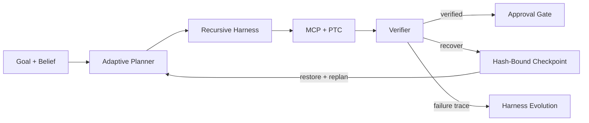
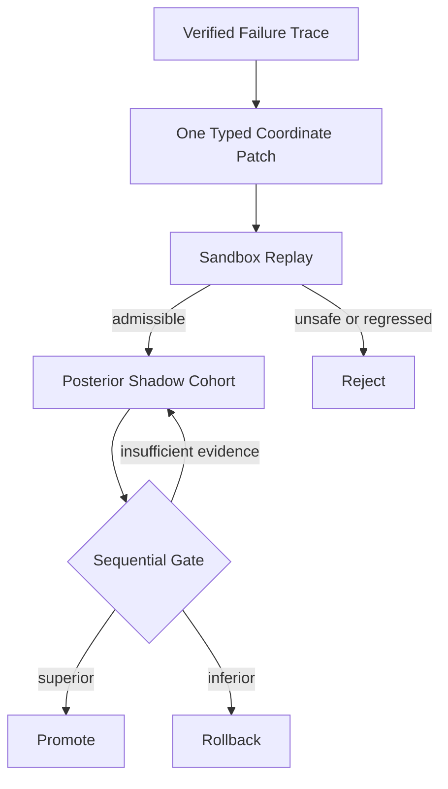
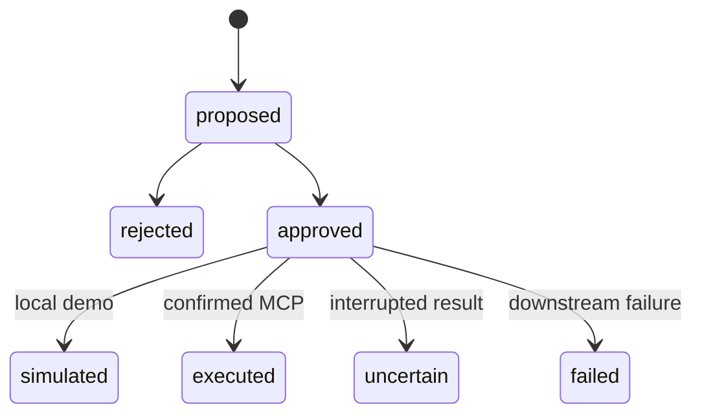

<div align="center">

# EcomEvo

[](https://github.com/jiaweine/EcomEvo-Harness/actions/workflows/ci.yml)
[](https://github.com/jiaweine/EcomEvo-Harness/actions/workflows/codeql.yml)

### 电商复杂问题处理与决策协作助手

**把商品治理、商家审核、售后争议、风险核查和内容审核，放进一个持续、可追溯、可确认的服务流程里。**

从描述问题、上传资料，到核对重点、补充缺失信息、查看办理进度和确认下一步，都在同一个任务空间完成。

</div>

---

## 你可以用 EcomEvo 做什么

| 场景 | 客户看到的结果 |
|---|---|
| **商品治理** | 核对标题、图片、品牌、声明和资质是否一致，并提示需要补充的资料 |
| **商家审核** | 整理主体、授权链、经营范围和风险信息，明确还缺什么、下一步做什么 |
| **售后判责** | 汇总订单、物流、聊天和媒体资料，帮助梳理争议点和处理依据 |
| **风险核查** | 区分已确认信息、待核对线索和反向信息，把需要人工判断的部分单独提示 |
| **内容审核** | 检查图文一致性、误导风险、违规点和资料缺口，并给出可执行的修改建议 |

EcomEvo 把复杂的内部处理过程翻译成客户真正关心的四件事：**现在处理到哪、还缺什么、为什么这样判断、有没有需要自己确认的事情。**

---

## 使用体验

### 1. 说清楚要处理的问题

直接描述商品、商家、订单、售后或风险问题，也可以从常用业务入口开始。

### 2. 提交相关资料

支持文本、图片、表格、日志、音视频和常见文档类型。资料会跟随当前任务持续保留，不需要每一轮重新说明上下文。

### 3. 查看系统整理结果

界面会把信息分成客户容易理解的几类：

- **办理进度**：现在处理到哪一步；
- **相关资料**：当前判断使用了哪些资料；
- **待确认**：哪些动作需要客户或有权限的人确认；
- **已上传**：当前任务已经提交过哪些附件。

### 4. 补充缺失信息

如果信息不足，EcomEvo 会直接说明缺什么，不用技术状态码或内部术语描述问题。

### 5. 确认高影响动作

退款、下架、审核结论、风险升级等可能改变真实业务状态的动作，不会因为一次自动判断就直接执行。它们会进入明确的确认边界。

---

## 为什么客户可以信任这个流程

| 原则 | 在产品里的表现 |
|---|---|
| **资料优先** | 结论尽量回到已提交资料、规则和工具结果，不把生成文本本身当作事实 |
| **缺失信息可见** | 信息不够时明确告诉客户缺什么，不用虚假的完整度或置信度掩盖缺口 |
| **高影响动作需确认** | 会改变商品、商家、订单或风险状态的动作进入人工确认边界 |
| **任务可以恢复** | 当前任务、资料、处理记录和恢复状态属于同一个持续任务，不因为页面刷新而丢失 |
| **系统失败不会伪装成成功** | 下游结果无法确认时保留不确定状态，不把中断包装成已完成 |
| **更新必须经过门禁** | 内部策略优化需要先经过回放、回归和安全检查，不能直接改变业务安全边界 |

---

## 产品界面

当前 `main` 使用客户服务型界面：暖色工作画布、清晰任务入口、客户语言的办理进度与资料面板，以及克制的服务状态展示。


<sub>真实 Uvicorn + Chromium Browser E2E 采集。画面来自可运行产品，不是概念稿、设计稿或第三方产品界面。</sub>

客户界面、文案和视觉层级的完整约束见 [`DESIGN.md`](DESIGN.md)。设计规范负责展示层，算法、API、权限和后端数据结构保持独立。

---

## 本地体验

### macOS / Linux

```bash
git clone https://github.com/jiaweine/EcomEvo-Harness.git
cd EcomEvo-Harness

python -m venv .venv
source .venv/bin/activate
python -m pip install -e .

cp .env.example .env
uvicorn ecomevo.api.app:app --host 0.0.0.0 --port 8000
```

### Windows PowerShell

```powershell
git clone https://github.com/jiaweine/EcomEvo-Harness.git
cd EcomEvo-Harness

python -m venv .venv
.venv\Scripts\Activate.ps1
python -m pip install -e .

Copy-Item .env.example .env
uvicorn ecomevo.api.app:app --host 0.0.0.0 --port 8000
```

### Docker

```bash
docker build -t ecomevo .
docker run --rm -p 8000:8000 --env-file .env -v ecomevo-data:/app/outputs ecomevo
```

打开 `http://localhost:8000`。没有配置外部模型时，仍可以使用本地受控模式体验文本、结构化资料和任务流程。

---

# Engineering · 技术底座

下面的内容面向开发者、研究人员和希望深入理解实现的人。正常使用 EcomEvo 不需要掌握这些概念。

<details>
<summary><b>01 · Runtime Architecture</b></summary>

EcomEvo 内部仍然是一个模型无关的 Agent Harness Runtime。Model、Tool、Skill、Memory、Sandbox 与 Verifier 可以替换；任务事实、权限约束、事件历史和恢复路径由 Runtime 持有。



主链路：

**目标解析 → Belief State → 自主规划 → 递归子 Agent → 工具执行 → 验证回滚 → Harness 演进**

模型负责推理，Harness 负责让推理可执行、可验证、可恢复、可演进。

</details>

<details>
<summary><b>02 · Frozen Kernel × Evolvable Harness</b></summary>

### 可演进坐标

| Coordinate | Runtime role | Evolution boundary |
|---|---|---|
| Prompt | 任务解释、计划提示与角色约束 | 只修改认知提示，不改变权限 |
| Tool | Skill 与只读工具的选择策略 | 只能从 Registry 与 Sandbox 允许集合中选择 |
| Memory | 失败模式、业务经验与检索上下文 | 不覆盖事件事实与原始证据 |
| Delegation | 子任务拆分、深度与 specialist 路由 | 受递归深度、预算、并发和 deadline 限制 |

### 冻结安全内核

| Frozen component | Invariant |
|---|---|
| Registry | 插件槽位与能力契约固定；实现可在任务之间原子替换 |
| Sandbox | 工具副作用与执行边界不可被候选 patch 绕过 |
| Verifier | 证据、约束、输出与副作用独立校验 |
| RBAC / Approval | 高影响动作始终需要具备权限的人确认 |
| BusinessAction | proposed、approved、simulated、executed、uncertain、failed 保持语义分离 |
| Event Store | append-only hash chain、checkpoint 与 fork 构成任务事实源 |

Harness Evolution 只改变 Prompt、只读 Tool routing、Memory 与 Delegation 四类认知坐标，不能修改安全内核。

</details>

<details>
<summary><b>03 · Adaptive Planning</b></summary>

Planner 先由 Registry、Sandbox、RBAC、预算与任务约束构造合法动作集合，再在集合内学习：

$$
\mathcal{A}_{legal}(s)=\mathcal{A}_{registered}\cap\mathcal{A}_{sandbox}\cap\mathcal{A}_{authority}\cap\mathcal{A}_{budget}
$$

EvoGain-APR 用上下文描述任务状态，对 Skill、Tool、Sub-Agent 与 Stop 维护 Bayesian posterior，并在预期收益、风险和成本之间选择：

$$
a_t=\arg\max_{a\in\mathcal{A}_{legal}}\left(\mu_a(x_t)+\beta\sigma_a(x_t)-\lambda C(a)\right)
$$

当所有候选的净价值不足时，Planner 可以 abstain，而不是为了制造轨迹继续调用工具。

</details>

<details>
<summary><b>04 · Verification, Recovery and Credit</b></summary>

Verifier 以证据完备性、约束满足度和副作用安全性形成势能，并用 leave-one-out 反事实衡量工具调用的真实增量：

$$
\Delta_i=\Phi(E)-\Phi(E\setminus\{e_i\})
$$

Checkpoint 同时绑定事件位置、事件 hash 与状态 hash：

$$
c_k=(k, h^{event}_k, h^{state}_k)
$$

恢复前重新核验事件链和状态链。Verifier 触发 rollback 后，只从完整性验证通过的 checkpoint 重建 Belief State，再基于失败信息重新规划。

</details>

<details>
<summary><b>05 · Failure-Driven Evolution</b></summary>



Tool coordinate 必须先通过逐案例回放门禁：

$$
\forall i,\; S_i(candidate)\ge S_i(baseline)-\epsilon_i
$$

Prompt、Memory 与 Delegation 的离线阶段主要验证安全、字段边界与可表示性，性能比较交给真实 verifier cohort。证据不足时继续观察，不会因为一次离线平均分更高就直接上线。

</details>

<details>
<summary><b>06 · Plugin Runtime Contract</b></summary>

| Layer | Guarantee |
|---|---|
| Contract | 每个插件槽位声明必需方法与属性，加载前校验 API 版本与能力 |
| Rebind | Planner、Tool、PTC、Skill、Sandbox、Verifier 等替换后同步进入真实依赖图 |
| Lifecycle | `plugin_start` 与 `plugin_stop` 失败时回滚实例、版本和依赖绑定 |
| Concurrency | 有任务运行时拒绝替换，保证单条事件轨迹只对应一代插件图 |
| Discovery | `ecomevo.plugins` entry point 仅发现元数据，第三方代码必须显式加载 |

开发与打包规范见 [Plugin Runtime](docs/PLUGIN_RUNTIME.md)。

</details>

---

# Verification · 仓库实际验证了什么

| Gate | Verified scope |
|---|---|
| Python regression | Runtime、Event Store、Planner、Verifier、MCP、RBAC 与演进逻辑 |
| Gold Set | 业务案例 fresh run 与 persisted replay |
| Product smoke | 临时 durable root 下验证任务、资料、动作与 API 主链 |
| Pressure gate | 多并发 Runtime、PTC deadline 与 adaptive-policy contention |
| Browser E2E | 真实 Uvicorn + Chromium，桌面、移动、WebSocket、任务恢复和产品截图 |
| Packaging | 构建 wheel，在干净环境安装并启动 health、首页与静态资源 |
| Container | 非 root、只读根文件系统、独立数据挂载与 health probe |
| Security | pip-audit、Bandit 与 CodeQL Python / JavaScript |

CI 通过的是可运行代码和真实产品链路，不是 README 中的静态声明。

---

# Product Boundary · 真实业务动作边界



`simulated` 只代表本地演示链路完成；`executed` 只用于已经确认的真实下游结果。传输中断且无法确认副作用时进入 `uncertain`，不会伪装成成功或普通失败。

| Capability | Status | Boundary |
|---|---|---|
| Plugin Runtime | READY | 契约校验、生命周期、任务间热替换、依赖重绑定与显式 entry-point 加载 |
| Event-Sourced Runtime | READY | Goal / Belief / Task 事件、hash chain、checkpoint 与 fork |
| Adaptive Planner | READY | Bayesian routing、成本收益、abstention 与反事实 credit |
| Recursive Agent + PTC | READY | 有界递归与有界并行只读工具组合 |
| Verifier recovery | READY | 证据、约束、副作用验证与 hash-bound rollback |
| Harness Evolution | GATED | Replay + Regression + shadow posterior；安全内核不可演进 |
| High-impact action | GUARDED | 必须经过明确人工确认 |
| Real commerce execution | CONFIG | 需要可用 MCP、企业身份与下游业务系统 |

---

# API Surface

| Surface | Endpoint |
|---|---|
| Product / health | `/api/product` · `/healthz` · `/api/health` |
| Provider / runtime | `/api/providers` · `/api/runtime` · `/api/evolution` |
| Conversations | `/api/conversations` · `/api/conversations/{id}` |
| Assets | `/api/conversations/{id}/assets` · preview · scope · delete |
| Messages / actions | `/api/conversations/{id}/messages` · `/api/conversations/{id}/actions` |
| Runtime events | `/api/runtime/sessions/{session_id}/events` |
| Live updates | WebSocket task event channel |

---

# Repository Map

```text
ecomevo/
├── api/                 Product API, durable jobs, identity and RBAC
├── runtime/             Events, planner, agents, tools, verifier and evolution
└── web/                 Commerce decision workbench

docs/                    Architecture, algorithms, evolution and deployment
scripts/                 Smoke, evaluation, pressure and browser gates
tests/                   Runtime, product, security and concurrency regression
```

| Document | Scope |
|---|---|
| [DESIGN](DESIGN.md) | 客户界面、文案、视觉层级与前端展示边界 |
| [ARCHITECTURE](docs/ARCHITECTURE.md) | 系统组件、数据流与边界 |
| [AUTONOMY](docs/AUTONOMY.md) | 自主循环、停止、恢复与权限 |
| [ALGORITHM](docs/ALGORITHM.md) | EvoGain-APR、Bayesian routing 与 credit |
| [HARNESS EVOLUTION](docs/HARNESS_EVOLUTION.md) | Replay、shadow、promotion 与 rollback |
| [TECHNICAL MANUAL](docs/TECHNICAL_MANUAL.md) | API、durable job、MCP、身份与部署 |
| [VERIFICATION REPORT](docs/VERIFICATION_REPORT.md) | 工程验证记录 |
| [CONTRIBUTING](CONTRIBUTING.md) | 开发门禁与架构不变量 |
| [SECURITY](SECURITY.md) | 安全支持范围与漏洞报告 |

---

<div align="center">

**EcomEvo**

**把复杂电商问题变成清晰、持续、可追溯、可确认的处理流程。**

Engineering foundation: Evidence First · Recovery by Design · Evolution Behind Gates

</div>
