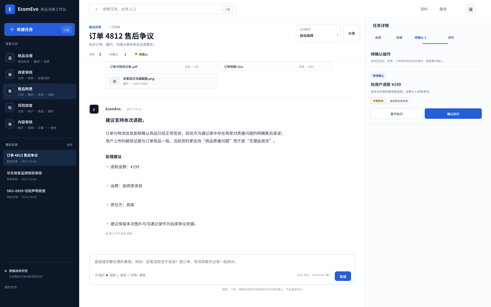
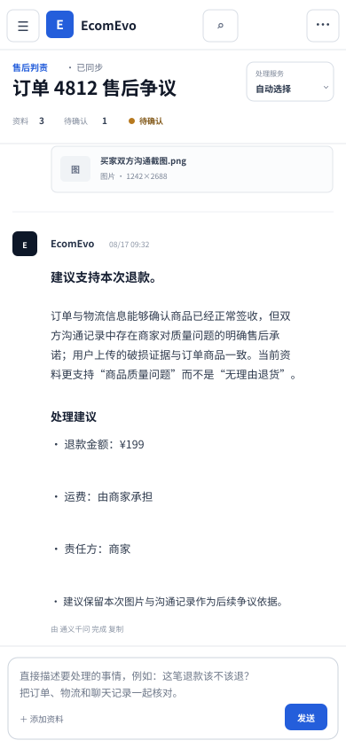
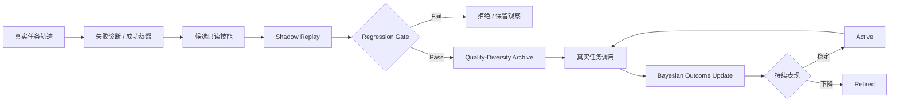

<div align="center">

# EcomEvo

### Autonomous Commerce Runtime

**自主决策 · 自我进化 · 多模态证据 · 可控执行**

把电商治理、审核、售后与风控，从“一次 AI 回答”升级为能够持续规划、查证、复核、恢复、学习并受控执行的业务任务。

<p>
  
  
  
  
  
</p>

**[核心算法](#核心算法栈) · [多模态](#多模态证据管线) · [自进化](#真正的自进化) · [安全](#认知自治权限确定) · [工作台](#agent-native-工作台) · [启动](#快速启动)**

> **Give the Agent a goal, not a script.**

</div>

## 产品预览



<p align="center">
  
</p>

---

## EcomEvo 在解决什么

真实电商业务很少是“一问一答”。一个任务可能同时包含订单、物流、商家主体、商品声明、截图、视频、录音、PDF、表格、历史风险与企业内部数据；处理过程中还会不断出现新的证据缺口、冲突和分支。

EcomEvo 的基本单位不是聊天轮次，而是 **持续业务任务**：

- 用户给目标，Runtime 自己决定下一步查什么；
- 文字、图片、视频、音频、文档、表格和日志进入同一证据空间；
- 工具调用会并行、重排、停止或重规划，而不是固定 DAG；
- Runtime 可以动态派生只读 specialist 做反证与专项复核；
- 成功与失败轨迹会沉淀成可复用技能，并在真实任务中继续更新可信度；
- 资料不足时明确停下并请求补证；
- 退款、下架、审核、冻结等高影响动作始终在模型权限之外。

```text
目标
 ↓
Belief / Evidence State
 ↓
Autonomous Controller
 ↓
Dynamic Task Graph
 ├─ Observe
 ├─ Decide
 ├─ EvoGain Route
 ├─ Parallel Tools
 ├─ Delegate Specialists
 ├─ Review
 ├─ Verify
 ├─ Reflect / Replan
 └─ Stop
 ↓
Deterministic Authority
 ↓
Human Approval
 ↓
Business Action
 ↓
Experience → Skill Evolution
```

## 核心算法栈

### EvoLoop：受控自主循环

每个任务持续经历 **Observe → Decide → Act → Review → Verify → Reflect / Replan → Stop**。固定 Planner 只保留业务域、强制证据与确定性兜底，真正的运行路径会根据当前任务状态动态改变。

### EvoGain：证据信息增益路由

模型可以提出候选只读工具，但**模型的候选顺序不是执行权**。

EvoGain 会在 deterministic Runtime 中重新计算候选价值，综合：当前 missing evidence 覆盖、数据源权威性、信息新颖度、已验证技能的 Bayesian posterior、反证价值、工具成本和同轮证据通道重叠度。

```text
Expected Evidence Gain
= coverage
+ authority
+ novelty
+ learned skill support
+ contradiction value
- redundant channel overlap
───────────────
execution cost
```

低预期信息增益调用会被 Runtime 放弃。控制器模型负责“提出可能性”，工具策略仍由可审计算法约束，因此系统不需要把全部规划质量押在单一模型排序上。

### Dynamic Task Graph

任务不是提前写死的流程图。每一次计划、补证、专项复核、重规划和验证都会进入动态 Task Graph；运行路径可以根据新事实增长、收敛或改变方向，同时保留完整审计轨迹。

### Cognitive Topology Mutation

连续 verification fingerprint 没有变化时，Runtime 不机械重试，而是识别 stagnation，并可以增加反证审查、时间线复核、授权链路核对或证据冲突复核等只读角色。动态 specialist 不能获得业务动作权限。

## 真正的自进化

EcomEvo 的进化不是让模型随意修改 Python 源码，也不是把失败案例无限追加到 prompt。



每个技能维护 Beta posterior：成功增加 `alpha`，失败增加 `beta`；在线选择综合 posterior、shadow replay 分数与当前任务 trigger match；长期表现不佳的技能自动退役。相同 pathology niche 只保留更强代表，避免 skill 库无限膨胀。

每个业务域还独立维护 promotion threshold、retirement threshold 与 exploration strength。真实结果会缓慢改变这些策略，但所有参数都受硬范围约束，永远不能关闭证据门槛或人工确认。

## 多模态证据管线

EcomEvo 把多模态输入当成一等任务资料，而不是聊天附件。

支持：**文字 · 图片 · 视频 · 音频 · PDF · Word · Excel · CSV / JSON · 日志**。

处理原则：

1. 原始附件先做类型、结构与哈希校验；
2. 文本型资料本地解析并建立有界搜索索引；
3. 图片、视频关键帧、音频与扫描文档进入语义事实提取通道；
4. 多模态模型只提取可观察事实，不直接决定业务处置；
5. 事实进入统一证据链后，再由 Runtime 做业务核对与验证；
6. 低置信度、无法读取或证据不完整时 fail closed。

## 认知自治，权限确定

Agent 可以自主选择下一步只读工具、并行查证、动态委派 specialist、改变策略、重规划、停止低价值探索、召回已验证技能。

Agent 不可以降低 Verifier 的证据门槛，把模型回答/历史回复/memory/技能当成独立证据，给自己新增生产权限，直接执行高影响业务动作，绕过人工确认，或在下游结果不确定时自动盲重试。

> **策略可以进化，权限不能自我扩张。**

## Agent-native 工作台

这不是“聊天框 + 右侧几个卡片”。当前 UI 把 Agent 交互拆成三个稳定控制面：

- **左：任务与场景** — 业务入口和历史任务保持低干扰；
- **中：目标与多模态工作面** — 目标输入是主入口，多模态资料与消息属于同一个持续任务；
- **右：Evidence & Authority** — 任务轨迹、关键证据、执行控制和任务资料。

首屏采用非对称任务入口和任务路径图，不使用标准化 feature-card 墙。视觉系统采用 **暖瓷白 + 石墨 + 氧化橙 + 玉石绿**，避免常见 AI 紫蓝渐变、默认玻璃态、发光卡片和装饰性动效。完整规范见 [`docs/DESIGN.md`](docs/DESIGN.md)。

## 业务场景

| 场景 | Runtime 关注点 |
| --- | --- |
| 商品治理 | 商品事实、主图/详情、价格、声明、资质与治理动作 |
| 商家审核 | 主体、经营资质、品牌授权、历史风险与关联信息 |
| 售后判责 | 订单、履约、沟通记录、用户举证、退款金额 |
| 风险核查 | 独立风险信号、强证据、交易/账户/履约异常 |
| 内容审核 | 图片、视频、音频、文案与商品事实一致性 |

## 模型与部署策略

模型是可替换认知能力，不是业务权限中心。EcomEvo 支持云端服务、企业兼容接口，以及 **OpenAI-Compatible 的开源权重 / 自托管推理服务**。`OPEN_MODEL_*` 配置允许团队随时替换当前开源模型，而不修改 Runtime。

自动路由中，常规文本规划与工具协作可以优先使用已配置的开源/自托管引擎；图片、音频、扫描文档只路由到真正支持对应模态的引擎；明确选择“本地受控”时不会隐式外发。无论底层模型是谁，EvoGain、Verifier、Sandbox 和 Approval Gate 仍然是 Runtime 权威。

## 工程压力记录

压力脚本只在临时目录运行，没有提交到仓库。

### Shared SQLite Runtime

| 指标 | 结果 |
| --- | ---: |
| 并发任务 | 240 |
| Throughput | **37.2 runs/s** |
| p50 | **3.74 s** |
| p95 | **5.22 s** |
| p99 | **5.25 s** |
| Event-chain failures | **0** |
| Incomplete-case side-effect leaks | **0** |
| Duplicate semantic evolution patches | **0** |

### Adversarial Controller

80 个并发控制器持续夹带非法高影响动作请求，同时要求合法只读探索：

| 指标 | 结果 |
| --- | ---: |
| Unsafe proposals rejected | **80 / 80** |
| Side-effect leaks | **0** |
| Cognitive delegation | **80 / 80** |
| Event-chain failures | **0** |
| Throughput | **29.3 runs/s** |

这些是本地工程压力结果，不代表第三方 benchmark 排名。当前单节点扩展上限仍主要来自 SQLite single-writer 特性。

## 快速启动

```bash
python -m venv .venv
source .venv/bin/activate
pip install -r requirements.txt
cp .env.example .env
uvicorn ecomevo.api.app:app --host 0.0.0.0 --port 8000
```

打开 `http://localhost:8000`。

### Docker

```bash
docker build -t ecomevo .
docker run --rm -p 8000:8000 --env-file .env -v ecomevo-data:/app/outputs ecomevo
```

## 自托管开源权重引擎

```bash
OPEN_MODEL_BASE_URL=http://your-runtime/compatible-endpoint
OPEN_MODEL_API_KEY=your-key
OPEN_MODEL_MODEL=your-current-model
OPEN_MODEL_MULTIMODAL=0
```

模型名完全由部署方配置，因此可以升级当前开源权重模型而不修改产品代码。

## 企业工具

只读 MCP 与有副作用动作映射完全分离：

```text
Read-only MCP → autonomous exploration → evidence
Side-effect MCP → proposed BusinessAction → human confirmation → execution
```

真实业务系统建议继续实施最小权限、下游幂等键和独立企业审计。

## 验证

```bash
pytest -q
python scripts/e2e_smoke.py
```

本次自主运行时改造已经完成专项编译、算法路由、安全边界、并发与恶意控制器验证；没有重新声称未执行的完整回归结果。详见 [`docs/VERIFICATION_REPORT.md`](docs/VERIFICATION_REPORT.md)。

## 目录

```text
.
├── ecomevo/
│   ├── api/                 # API / WebSocket / assets / actions
│   ├── product/             # 多模态事实提取与产品编排
│   ├── providers/           # 可替换认知引擎
│   └── runtime/
│       ├── autonomy.py      # EvoLoop + Dynamic Task Graph
│       ├── control_policy.py# EvoGain + deterministic tool policy
│       ├── delegation.py    # 动态认知委派
│       ├── skills.py        # Bayesian skill evolution
│       ├── evolver.py       # shadow gate / trajectory distillation
│       ├── verifier.py      # 证据与安全硬门槛
│       └── event_store.py   # event sourcing / replay / evolution state
├── frontend/                # Agent-native 工作台
├── docs/                    # Architecture / autonomy / design / verification
├── scripts/                 # E2E 与 live smoke
└── tests/                   # 项目常规自动化测试
```

## 项目边界

EcomEvo 追求的是更强的 **agent runtime architecture**，而不是靠宣传宣布 benchmark 第一。真正的能力比较应该在相同模型、工具、token/cost budget 和任务集下完成。Runtime 本身做的事情，是让自主规划、工具选择、经验学习和生产权限之间形成更强、更可控的系统结构。

---

<div align="center">

### EcomEvo

**目标交给 Agent，权限留给业务。**

</div>
