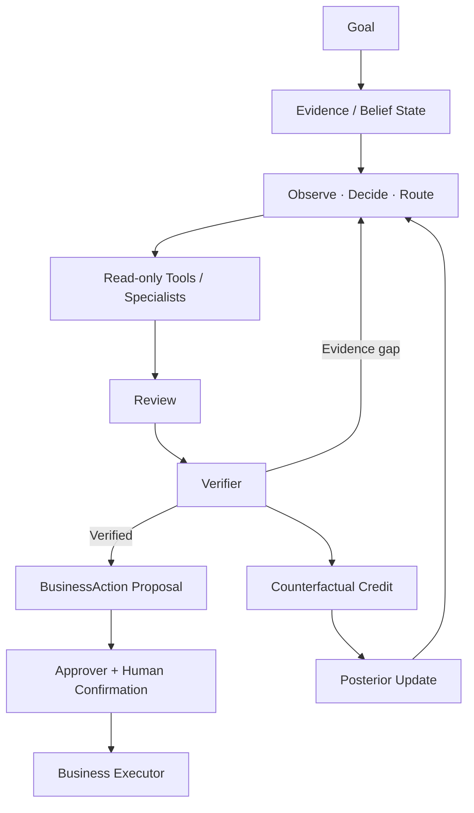

<p align="center"><sub>ECOMMERCE DECISION WORKBENCH</sub></p>

<h1 align="center">EcomEvo</h1>

<p align="center"><strong>把复杂电商业务，从“问 AI”推进到“持续查证、组织证据、形成可执行决策”。</strong></p>

<p align="center"><b>目标进入任务 · 证据持续累积 · 高影响动作始终受控</b></p>

<p align="center">
  
  
  
  <a href="https://github.com/jiaweine/EcomEvo-Harness/pull/3"></a>
</p>

<p align="center">
  <b><a href="docs/ARCHITECTURE.md">架构</a> · <a href="docs/DESIGN.md">设计</a> · <a href="docs/VERIFICATION_REPORT.md">验证</a> · <a href="https://github.com/jiaweine/EcomEvo-Harness/pull/3">Adaptive Runtime · PR #3</a></b>
</p>

<br />

<p align="center">
  
</p>

<p align="center">
  <sub><b>EcomEvo 商业决策工作台</b> · 把目标、对话、多模态资料、判断依据和待确认业务动作放进同一个持续任务。</sub>
</p>

<br />

## 一句话理解 EcomEvo

电商业务真正困难的部分，通常不是“模型会不会回答”，而是**信息散、证据多、规则复杂、系统多，而且最后还要对真实业务结果负责**。

一次商品治理可能同时涉及主图、详情页、功效声明、资质和品牌授权；一次售后判责可能需要订单、物流、聊天记录、图片、录音与平台规则；一次商家审核则需要把主体、授权链、经营范围和历史风险放在一起判断。

EcomEvo 把这些材料组织成一个持续任务，而不是把每一步拆成互不相干的聊天窗口。

<table>
  <tr>
    <td width="25%" valign="top"><b>Multimodal first</b><br/><br/>图片、视频、音频、PDF、Office、表格、日志与结构化业务数据进入同一个任务空间。</td>
    <td width="25%" valign="top"><b>Evidence oriented</b><br/><br/>不是只生成答案，而是明确事实、依据、缺口、冲突和仍需补充的材料。</td>
    <td width="25%" valign="top"><b>Continuous task</b><br/><br/>用户可以持续补资料、追问和修改要求，不需要每次重新建立业务上下文。</td>
    <td width="25%" valign="top"><b>Controlled action</b><br/><br/>高影响业务动作与判断过程分开，确认、权限和执行结果保留明确边界。</td>
  </tr>
</table>

<br />

## 产品 · Product

### 一面工作台，看完整任务，而不是只看一段对话

<p align="center">
  
</p>

<p align="center"><sub><b>Evidence Space</b> · 商品主图、详情、资质、授权、声明与历史风险可以被组织为同一个证据空间。</sub></p>

<br />

<table>
  <tr>
    <td width="52%" align="center" valign="top">
      
      <br/><br/><sub><b>Runtime Control</b> · 让证据状态、停止条件与权限边界成为可见状态，而不是隐藏在一次模型回答里。</sub>
    </td>
    <td width="48%" valign="middle">
      <h3>从“答案”转向“业务闭环”</h3>
      <p>任务里同时存在目标、资料、事实、依据、缺口、判断与待确认动作。</p>
      <p>用户不需要看到隐藏思维链，但应该能够知道：<b>当前材料够不够、还缺什么、判断依据是什么、最后一步由谁确认。</b></p>
      <p>这也是 EcomEvo 与普通聊天式工具最重要的产品差异。</p>
    </td>
  </tr>
</table>

<br />

### 同一产品语言，覆盖五类高价值业务任务

<p align="center">
  
</p>

| 场景 | EcomEvo 组织的问题 |
| --- | --- |
| **商品治理** | 主图、详情、声明、品牌和资质是否彼此一致，哪里还缺证据 |
| **商家审核** | 主体、授权链、经营范围与历史风险能否形成可信闭环 |
| **售后判责** | 订单、物流、聊天、图片、录音和规则如何重建事实时间线 |
| **风险核查** | 弱线索、相关性、独立证据和反证如何被清楚区分 |
| **内容审核** | 图片、视频、音频、文案与结构化材料如何进入同一审核任务 |

<br />

<table>
  <tr>
    <td width="64%" valign="middle">
      <h3>桌面端是工作台，移动端仍然是同一个任务</h3>
      <p>窄屏不是把关键能力删除，而是重新组织空间。任务、资料、证据和待确认动作仍然围绕同一个 conversation 存在。</p>
      <p>产品设计目标不是“做一个手机版聊天框”，而是在不同屏幕上保持同一套业务语义。</p>
    </td>
    <td width="36%" align="center" valign="middle">
      
      <br/><sub><b>Mobile Control</b> · 同一任务语义，不同空间组织。</sub>
    </td>
  </tr>
</table>

<br />

## Adaptive Runtime Preview · PR #3

> **这一节描述正在 PR #3 中开发和验证的 Adaptive Autonomous Runtime。它不是在暗示 `main` 已经包含全部实现。**

下一阶段的 EcomEvo 把“持续任务”进一步推进成一个**受约束的自主证据获取 Runtime**：系统可以自己决定下一步应该查什么、是否需要反证、什么时候继续、什么时候停止；但真实业务权限始终位于学习层之外。

<p align="center"><b>认知自治，权限确定。</b></p>



模型提出的认知候选先被限制在安全可行域：

$$
\boxed{
\mathcal A_t^{\mathrm{safe}}
=
\hat{\mathcal A}_t
\cap \mathcal A^{\mathrm{registered}}
\cap \mathcal A^{\mathrm{read\text{-}only}}
\cap \mathcal A^{\mathrm{budget}}
\cap \mathcal A^{\mathrm{sandbox}}
}
$$

学习只负责在这个可行域里提高证据获取效率：

$$
\boxed{
\pi^{\star}
=
\arg\max_{\pi}
\;\mathbb E_{\pi}
\left[\sum_t \mathrm{Credit}_t\right]
\qquad
\text{s.t.}\quad
 a_t\in\mathcal A_t^{\mathrm{safe}}
}
$$

### EvoGain-APR · Adaptive Posterior Routing

Adaptive routing 把冷启动规则降级为 prior，再由真实任务 outcome 更新 contextual posterior。

$$
w\sim\mathcal N\!\left(\mu_0,\Lambda_0^{-1}\right)
$$

并以并行 round 为单位更新 sufficient statistics：

$$
\begin{aligned}
A_t
&=A_0+\delta\left(A_{t-1}-A_0\right)
+\sum_{i=1}^{k}x_i x_i^{\top},\\[4pt]
b_t
&=b_0+\delta\left(b_{t-1}-b_0\right)
+\sum_{i=1}^{k}r_i x_i,\\[4pt]
\mu_t&=A_t^{-1}b_t,\\[4pt]
\sigma_t^2(x)&=x^{\top}A_t^{-1}x.
\end{aligned}
$$

生产 routing 使用确定性的 UCB-style score：

$$
\boxed{
Q_t(x)
=\mu_t^{\top}x
+\beta_t\sqrt{x^{\top}A_t^{-1}x}
}
$$

它不仅学习“哪个工具更值得调用”，还学习“当前状态下继续调用是否比停止更值得”：

$$
\boxed{
\mathrm{Adv}_t(a_i\mid s_t)
=
Q_t(x_i)-Q_t\!\left(x_{\varnothing}(s_t)\right)
}
$$

只有当：

$$
\mathrm{Adv}_t(a_i\mid s_t)>0
$$

候选才值得进入执行集合。

### Verifier Difference Credit

学习信号不依赖模型给自己打分，而是比较“拿掉某个工具结果后，可验证状态到底下降了多少”。

先定义由 verifier quality $q(v)$ 和 evidence completeness $c(v)$ 共同限制的调和势能：

$$
\Phi(v)=
\frac{2q(v)c(v)}{q(v)+c(v)}
$$

然后做 deterministic leave-one-out：

$$
\boxed{
D_i
=
\Phi\!\left(V(R)\right)
-
\Phi\!\left(V(R\setminus\{r_i\})\right)
}
$$

再按工具成本归一化：

$$
\mathrm{Credit}_i
=
\frac{D_i}{1+\mathrm{Cost}_i}
$$

完整 Adaptive Runtime、durable execution、RBAC、MCP uncertainty 和 release-gate 工作都在 **[PR #3](https://github.com/jiaweine/EcomEvo-Harness/pull/3)** 中持续验证。

<br />

## 产品原则

<table>
  <tr>
    <td width="33%" valign="top"><b>01 · 证据优先</b><br/><br/>模型输出不是天然事实。结论应该能回到材料、结构化数据或企业工具结果。</td>
    <td width="33%" valign="top"><b>02 · 自主认知不等于自主权限</b><br/><br/>系统可以学习如何查证，但不能通过学习获得更多业务权限。</td>
    <td width="34%" valign="top"><b>03 · 产品状态必须可见</b><br/><br/>用户不需要隐藏思维链，但需要知道证据缺口、停止原因、待确认动作和执行结果。</td>
  </tr>
</table>

<br />

## Quick Start

```bash
python -m venv .venv
source .venv/bin/activate
python -m pip install -e .
cp .env.example .env
uvicorn ecomevo.api.app:app --host 0.0.0.0 --port 8000
```

打开：

```text
http://localhost:8000
```

### Docker

```bash
docker build -t ecomevo .
docker run --rm \
  -p 8000:8000 \
  --env-file .env \
  -v ecomevo-data:/app/outputs \
  ecomevo
```

<br />

## 文档

| 文档 | 重点 |
| --- | --- |
| **[ARCHITECTURE](docs/ARCHITECTURE.md)** | 当前主分支架构与组件边界 |
| **[DESIGN](docs/DESIGN.md)** | 产品 UI、响应式、中文排版与交互原则 |
| **[VERIFICATION REPORT](docs/VERIFICATION_REPORT.md)** | 当前主分支验证记录 |
| **[Adaptive Runtime · PR #3](https://github.com/jiaweine/EcomEvo-Harness/pull/3)** | 自主 Runtime、EvoGain-APR、durable execution、RBAC 与最新 release gates |

<br />

---

<p align="center"><b>EcomEvo</b></p>
<p align="center"><strong>把复杂任务组织成证据，把自主认知约束在权限边界之内。</strong></p>
<p align="center"><sub>Adaptive cognition. Deterministic authority.</sub></p>
